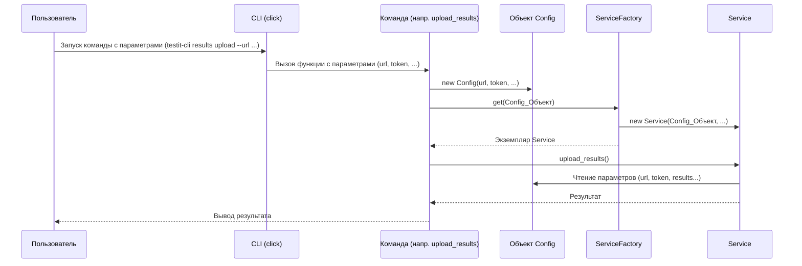

# Chapter 1: Конфигурация Запуска


Добро пожаловать в мир `testit-cli`! Это первая глава нашего путешествия, где мы разберемся с одним из самых foundational (основополагающих) понятий: Конфигурацией Запуска.

Представьте, что вам нужно отправить команду `testit-cli` на важную миссию: загрузить результаты тестов в систему Test IT. Как команда узнает, куда именно отправлять результаты? Какой проект использовать? Какой секретный ключ (токен) нужен для доступа? Вот тут-то и появляется наш герой – Конфигурация Запуска.

## Что такое Конфигурация Запуска (`Config`)?

Думайте о Конфигурации Запуска как о **листе с инструкциями** для `testit-cli`. Это специальный контейнер (в коде он называется `Config`), который хранит все важные детали, которые вы, как пользователь, передаете программе через команды в терминале.

Что же хранится в этом "листе инструкций"?

*   **Адрес Test IT (`url`):** Куда подключаться? (например, `https://demo.testit.software`)
*   **Секретный токен (`token`):** Ключ для доступа к вашему Test IT.
*   **ID Проекта (`project_id`):** В какой проект загружать данные? (используется, например, при импорте)
*   **ID Конфигурации (`configuration_id`):** Какую конфигурацию тестов использовать?
*   **ID Тест-рана (`testrun_id`):** В какой конкретный запуск тестов загружать результаты?
*   **Пути к результатам (`results`):** Где лежат файлы с результатами тестов, которые нужно загрузить?
*   **Пути к вложениям (`attachments`):** Есть ли дополнительные файлы (скриншоты, логи), которые нужно прикрепить?
*   **Флаги:** Дополнительные настройки, например:
    *   `is_debug`: Включить ли подробный вывод для отладки?
    *   `disable_cert_validation`: Отключить проверку SSL-сертификата (иногда нужно для тестовых сред)?
    *   `ignore_flaky_failure`: Игнорировать ли тесты со статусом "flaky"?

Этот объект `Config` – как компас и карта для `testit-cli`. Все остальные части программы заглядывают в него, чтобы понять, *что* нужно сделать и *с какими данными* работать.

## Как создается `Config`?

Когда вы запускаете команду `testit-cli` в вашем терминале, вы передаете ей параметры (аргументы). Например:

```bash
testit-cli results upload \
  --url https://mycompany.testit.software \
  --token MySecretToken \
  --configuration-id aaaaaaaa-bbbb-cccc-dddd-eeeeeeeeeeee \
  --testrun-id 11111111-2222-3333-4444-555555555555 \
  --results ./path/to/results \
  --attachments ./path/to/screenshots
```

Компонент, отвечающий за обработку команд (подробнее в главе [Обработка Команд Интерфейса (CLI)](02_обработка_команд_интерфейса__cli__.md)), берет все эти значения (`--url`, `--token` и т.д.) и аккуратно складывает их в объект `Config`.

## Структура `Config` (в коде)

Внутри кода `testit-cli` `Config` представлен как `dataclass` в Python. Не пугайтесь слова `dataclass` – это просто удобный способ создать класс, основная цель которого – хранить данные.

Вот как он выглядит (упрощенно):

```python
# Файл: src/testit_cli/models/config.py
from dataclasses import dataclass

@dataclass
class Config:
    url: str                     # Адрес Test IT
    token: str                   # API Токен
    project_id: str              # ID Проекта
    configuration_id: str        # ID Конфигурации
    testrun_id: str              # ID Тест-рана
    # ... другие поля ...
    results: list                # Список путей к файлам результатов
    is_debug: bool               # Флаг отладки
    paths_to_attachments: list   # Список путей к вложениям
    # ... и остальные поля ...
```

*   `@dataclass` - специальный "декоратор" Python, который автоматически добавляет базовые методы классу.
*   `url: str`, `token: str`, и т.д. - это поля класса с указанием их типа (`str` - строка, `list` - список, `bool` - булево значение (истина/ложь)).

## Пример использования `Config`

Давайте посмотрим, как объект `Config` создается внутри одной из команд (`upload_results`). Не волнуйтесь, если не все понятно в коде – главное увидеть, как параметры команды превращаются в `Config`.

```python
# Файл: src/testit_cli/click_commands.py

# ... (импорты и определения других частей) ...

# Определяем команду 'upload'
@results.command("upload")
# Определяем опции команды (аргументы --url, --token и т.д.)
@click.option("-u", "--url", type=str, required=True, ...)
@click.option("-t", "--token", type=str, required=True, ...)
@click.option("-ci", "--configuration-id", type=str, required=True, ...)
@click.option("-ti", "--testrun-id", type=str, required=True, ...)
@click.option("-r", "--results", multiple=True, required=True, ...)
# ... (другие опции) ...

# Функция, которая выполняется при вызове команды 'upload'
def upload_results(url, token, configuration_id, testrun_id, results, ...):
    """Загрузка результатов из разных источников"""

    # !!! ВОТ ОНО !!! Создаем объект Config из полученных параметров
    config = Config(
        url=url,
        token=token,
        project_id="", # Не используется в этой команде, поэтому пустая строка
        configuration_id=configuration_id,
        testrun_id=testrun_id,
        # ... (другие параметры) ...
        results=list(chain.from_iterable(results)), # Собираем пути к результатам
        is_debug=debug,
        paths_to_attachments=list(chain.from_iterable(attachments)),
        # ... (остальные параметры) ...
    )

    # Далее этот 'config' передается другим частям программы
    service = ServiceFactory().get(config)
    service.upload_results()
```

В этом коде:

1.  `@click.option(...)` определяет, какие аргументы командной строки ожидает команда `upload` (например, `--url`).
2.  Когда вы запускаете команду, `click` (библиотека для создания CLI) собирает значения этих аргументов.
3.  Эти значения передаются в функцию `upload_results` как параметры (`url`, `token`, `configuration_id`, и т.д.).
4.  Внутри функции создается экземпляр `Config`, куда и записываются все эти значения.
5.  Готовый объект `config` затем используется для настройки и запуска основной логики загрузки результатов.

## Внутренний поток: От команды до `Config`

Чтобы лучше понять место `Config` в общей картине, давайте посмотрим на последовательность действий:

1.  **Пользователь:** Запускает команду `testit-cli` с параметрами (например, `testit-cli results upload --url ... --token ...`).
2.  **CLI (Click):** Библиотека `click` разбирает введенную команду и извлекает значения параметров (`--url`, `--token` и т.д.). Об этом подробнее в главе [Обработка Команд Интерфейса (CLI)](02_обработка_команд_интерфейса__cli__.md).
3.  **Создание `Config`:** В коде команды (как в `upload_results` выше) создается объект `Config`, заполненный извлеченными значениями.
4.  **Фабрика Сервисов (`ServiceFactory`):** Объект `Config` передается в `ServiceFactory`. Это специальный компонент, который создает и настраивает другие части системы (например, клиент для общения с Test IT API).
5.  **Сервисный Слой (`Service`):** `ServiceFactory` создает основной `Service` (оркестратор), передавая ему `Config`. Подробнее об этом в главе [Сервисный Слой (Оркестратор)](04_сервисный_слой__оркестратор__.md).
6.  **Использование `Config`:** `Service` и другие компоненты (например, [Клиент API Test IT](03_клиент_api_test_it_.md), [Парсер Результатов Тестов](05_парсер_результатов_тестов_.md)) используют данные из объекта `Config` для выполнения своей работы (подключения к нужному URL, использования правильного токена, поиска файлов результатов и т.д.).

Вот как это выглядит на диаграмме:



## Как `Config` используется дальше?

Объект `Config` не просто создается и забывается. Он передается "по цепочке" другим компонентам. Например, `ServiceFactory` использует его для настройки `ApiClient` (клиента для работы с Test IT API):

```python
# Файл: src/testit_cli/service_factory.py
# ... (импорты)

class ServiceFactory:
    @staticmethod
    def get(config: Config) -> Service: # Принимает объект Config
        # Используем config.is_debug для настройки логгера
        Logger.register_logger(config.is_debug)

        # !!! Используем config.url и config.token для создания API клиента !!!
        api_client = ApiClient(
            url=config.url,
            token=config.token,
            disable_cert_validation=config.disable_cert_validation
        )
        # Используем config для создания парсера
        parser = Parser(config)
        # Используем config и api_client для создания импортера
        importer = Importer(api_client, config)
        # ... (создание других компонентов с использованием config)

        # Возвращаем Service, передав ему config и созданные компоненты
        return Service(config, api_client, parser, importer, autotests_filter)
```

Как видите, `url`, `token` и другие параметры из `config` напрямую используются для инициализации `ApiClient`, который будет общаться с вашим сервером Test IT. Точно так же другие компоненты получают `config` и используют нужные им поля.

## Заключение

В этой главе мы познакомились с Конфигурацией Запуска (`Config`). Мы узнали, что это:

*   Центральный "лист с инструкциями" для `testit-cli`.
*   Объект, хранящий все параметры, переданные пользователем (URL, токен, пути к файлам и т.д.).
*   Ключевой элемент, который создается при обработке команд и передается другим компонентам для их настройки и работы.

Понимание того, как `testit-cli` хранит и использует вашу конфигурацию, является первым шагом к освоению утилиты.

В следующей главе мы углубимся в то, как именно `testit-cli` получает эти инструкции от вас – как он обрабатывает команды, которые вы вводите в терминале.

Перейдем к [Главе 2: Обработка Команд Интерфейса (CLI)](02_обработка_команд_интерфейса__cli__.md)!

---

Generated by [AI Codebase Knowledge Builder](https://github.com/The-Pocket/Tutorial-Codebase-Knowledge)