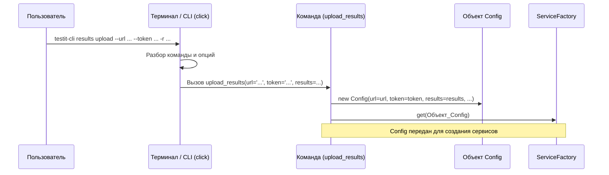

# Chapter 2: Обработка Команд Интерфейса (CLI)


В [предыдущей главе](01_конфигурация_запуска_.md) мы узнали о "листе с инструкциями" – объекте `Config`, который хранит все настройки для `testit-cli`. Но как эти инструкции попадают в программу? Как `testit-cli` понимает, что вы хотите сделать, когда вы печатаете команду в терминале?

Именно здесь в игру вступает **Обработка Команд Интерфейса (CLI)**. Представьте, что это "уши" и "мозг" `testit-cli`, которые слушают ваши команды и разбирают их на понятные части.

## Зачем нужна обработка команд?

Когда вы работаете с `testit-cli`, вы общаетесь с ним через **командную строку** (Command Line Interface - CLI). Вы пишете что-то вроде:

```bash
testit-cli results upload --url https://... --token XXX --results ./reports
```

Эта строка содержит много информации:
*   **Основная программа:** `testit-cli`
*   **Группа команд:** `results` (работа с результатами)
*   **Конкретная команда:** `upload` (загрузить)
*   **Параметры (опции):**
    *   `--url` со значением `https://...`
    *   `--token` со значением `XXX`
    *   `--results` со значением `./reports`

Просто так программа не поймет эту строку. Ей нужен специальный механизм, который:
1.  **Распознает** команду (`results upload`).
2.  **Извлечет** параметры и их значения (`--url`, `--token` и т.д.).
3.  **Проверит**, все ли обязательные параметры указаны.
4.  **Проверит**, правильный ли формат у значений (например, что URL похож на URL).
5.  **Передаст** эту информацию дальше, чтобы выполнить нужную задачу (например, запустить загрузку результатов).

Вот эту задачу и решает модуль обработки команд интерфейса в `testit-cli`.

## Библиотека `click`: Наш Помощник

Чтобы не изобретать велосипед, `testit-cli` использует популярную библиотеку Python под названием `click`. `click` делает создание красивых и удобных командных интерфейсов намного проще.

Думайте о `click` как о конструкторе Lego для команд:
*   Он предоставляет "кубики" (декораторы, функции) для определения команд (`upload`, `import`, `create`).
*   Он позволяет определить, какие "детали" (параметры `--url`, `--token`, флаги `--debug`) нужны для каждой команды.
*   Он автоматически создает справку (`--help`) для ваших команд.
*   Он берет на себя рутину по разбору того, что ввел пользователь.

## Как это работает на практике?

Давайте посмотрим, как `testit-cli` определяет команду `results upload` с помощью `click`.

**Шаг 1: Определение Групп Команд**

Сначала мы создаем основные группы команд. У `testit-cli` есть, например, группа `results` (для работы с результатами) и группа `testrun` (для работы с тест-ранами).

```python
# Файл: src/testit_cli/click_commands.py
import click

# Создаем главную точку входа
@click.group()
def execute():
    pass # Эта функция пока ничего не делает, она просто контейнер

# Создаем подгруппу 'results' внутри 'execute'
@execute.group()
def results():
    """Работа с результатами тестов""" # Описание для --help
    pass

# Создаем подгруппу 'testrun' внутри 'execute'
@execute.group()
def testrun():
    """Работа с тест-раном""" # Описание для --help
    pass
```

*   `@click.group()`: Превращает функцию Python (`execute`, `results`, `testrun`) в группу команд. Теперь мы можем добавлять подкоманды к ним.

**Шаг 2: Определение Конкретной Команды и её Опций**

Теперь добавим команду `upload` в группу `results` и укажем, какие параметры она принимает.

```python
# Файл: src/testit_cli/click_commands.py
# ... (импорты и группы команд выше) ...

# Добавляем команду 'upload' к группе 'results'
@results.command("upload")
# Определяем опцию --url (короткий вариант -u)
@click.option("-u", "--url", type=str, required=True, help="Адрес Test IT")
# Определяем опцию --token (короткий вариант -t)
@click.option("-t", "--token", type=str, required=True, help="API токен")
# Определяем опцию --results (короткий вариант -r), может быть несколько
@click.option("-r", "--results", multiple=True, required=True, help="Путь к файлам результатов")
# ... (Определения других опций: --configuration-id, --testrun-id, --debug и т.д.)

# Функция, которая будет вызвана при запуске 'testit-cli results upload ...'
def upload_results(url, token, results, **other_options): # Параметры функции соответствуют опциям
    """Загрузка результатов из разных источников"""
    print(f"Получен URL: {url}")
    print(f"Получен токен: {token}")
    print(f"Получены пути к результатам: {results}")

    # !!! Здесь происходит создание объекта Config, как в Главе 1 !!!
    config = Config(
        url=url,
        token=token,
        results=list(chain.from_iterable(results)), # Преобразуем для Config
        # ... (другие параметры из other_options передаются в Config) ...
    )

    # Далее config используется для запуска основной логики
    # service = ServiceFactory().get(config)
    # service.upload_results()
    print("Объект Config создан!") # Для примера
```

*   `@results.command("upload")`: Регистрирует функцию `upload_results` как команду `upload` внутри группы `results`.
*   `@click.option(...)`: Определяет параметр командной строки.
    *   `-u`, `--url`: Короткий и длинный варианты имени параметра.
    *   `type=str`: Ожидаемый тип значения (строка). `click` попытается преобразовать ввод к этому типу.
    *   `required=True`: Этот параметр обязателен. `click` выдаст ошибку, если пользователь его не укажет.
    *   `multiple=True`: Параметр можно указывать несколько раз (например, `-r file1.xml -r file2.xml`).
    *   `help="..."`: Текст подсказки, который будет показан в `--help`.
*   Функция `upload_results(url, token, results, ...)`: Именно эта функция вызывается библиотекой `click`, когда пользователь вводит команду `testit-cli results upload`. `click` автоматически передает значения из параметров командной строки (`--url`, `--token` и т.д.) в аргументы этой функции.
*   **Связь с Главой 1:** Внутри этой функции (`upload_results`) мы видим, как извлеченные `click`-ом значения (`url`, `token`, `results` и т.д.) используются для создания того самого объекта `Config`, о котором мы говорили в [Главе 1: Конфигурация Запуска](01_конфигурация_запуска_.md).

## Внутренний Поток: От Команды до `Config`

Давайте проследим путь информации:

1.  **Пользователь:** Вводит в терминал `testit-cli results upload --url https://... --token XXX -r report.xml`.
2.  **`click`:**
    *   Видит `testit-cli`.
    *   Находит группу `results`.
    *   Находит команду `upload` внутри `results`.
    *   Распознает опции `--url`, `--token`, `-r`.
    *   Извлекает их значения: `https://...`, `XXX`, `report.xml`.
    *   Проверяет, что все `required=True` опции указаны.
3.  **Вызов Функции:** `click` вызывает функцию `upload_results`, передавая ей извлеченные значения: `upload_results(url='https://...', token='XXX', results=('report.xml',), ...)`.
4.  **Создание `Config`:** Внутри `upload_results` создается объект `Config`, заполняясь этими значениями.
5.  **Передача Дальше:** Объект `Config` передается компонентам, отвечающим за основную логику (например, [Сервисному Слою](04_сервисный_слой__оркестратор_.md) через `ServiceFactory`).

Вот как это выглядит на схеме:



## Валидация Ввода

Еще одна важная задача, которую помогает решить `click` – это **валидация** (проверка) введенных данных. Например, ID проектов, конфигураций и тест-ранов в Test IT имеют специальный формат (UUID). Нужно убедиться, что пользователь ввел именно такой формат.

`click` позволяет указать функцию `callback` для опций. `testit-cli` использует это для проверки UUID и URL.

```python
# Файл: src/testit_cli/click_commands.py
# ... (импорты)
from .validation import validate_uuid, validate_url # Импортируем функции проверки

# ... (определения групп и команд)

@results.command("upload")
@click.option("-u", "--url", ..., callback=validate_url) # Проверка URL
@click.option("-t", "--token", ...)
@click.option("-ci", "--configuration-id", ..., callback=validate_uuid) # Проверка UUID
@click.option("-ti", "--testrun-id", ..., callback=validate_uuid) # Проверка UUID
# ... (другие опции)
def upload_results(url, token, configuration_id, testrun_id, ...):
    # ... (код функции)
    pass
```

*   `callback=validate_url`: Перед тем, как передать значение `--url` в функцию `upload_results`, `click` вызовет `validate_url` с этим значением. Если функция `validate_url` решит, что формат неверный, она вызовет ошибку, и программа завершится с понятным сообщением для пользователя. То же самое происходит с `validate_uuid` для ID.

Это гарантирует, что дальше по программе (в `Config` и другие компоненты) попадут данные в ожидаемом формате.

## Заключение

В этой главе мы разобрались, как `testit-cli` понимает ваши команды, введенные в терминал. Мы узнали:

*   Что обработка CLI – это процесс разбора команд и их параметров.
*   Что `testit-cli` использует библиотеку `click` для определения команд (`results upload`, `testrun create`) и опций (`--url`, `--token`, `--debug`).
*   Как с помощью декораторов `@click.group`, `@group.command`, `@click.option` описывается структура интерфейса командной строки.
*   Как `click` извлекает значения, переданные пользователем, и передает их в соответствующие функции Python.
*   Как эти значения затем используются для создания знакомого нам объекта `Config` из [Главы 1](01_конфигурация_запуска_.md).
*   Как `click` помогает проверять корректность введенных данных (валидация).

Теперь, когда мы знаем, как пользователь передает инструкции (`Config`) в `testit-cli`, мы готовы посмотреть, как `testit-cli` использует эти инструкции для выполнения реальной работы. Первым шагом будет общение с сервером Test IT.

Перейдем к [Главе 3: Клиент API Test IT](03_клиент_api_test_it_.md), чтобы узнать, как `testit-cli` взаимодействует с Test IT по сети!

---

Generated by [AI Codebase Knowledge Builder](https://github.com/The-Pocket/Tutorial-Codebase-Knowledge)