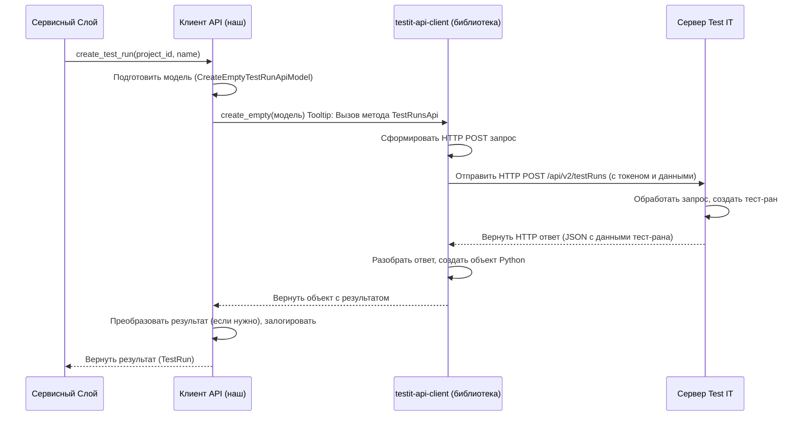

# Chapter 3: Клиент API Test IT


В [предыдущей главе](02_обработка_команд_интерфейса__cli__.md) мы узнали, как `testit-cli` "слушает" ваши команды в терминале и превращает их в структурированный "лист с инструкциями" - объект [Конфигурация Запуска (`Config`)](01_конфигурация_запуска_.md). Теперь у нас есть все нужные данные: адрес сервера Test IT, токен доступа, пути к файлам и так далее.

Но как `testit-cli` будет использовать эту информацию для реального общения с вашим сервером Test IT? Как он отправит результаты тестов или создаст новый тест-ран? Для этого нужен специальный компонент – **Клиент API Test IT**.

## Зачем нужен Клиент API?

Представьте, что `testit-cli` – это ваша страна, а сервер Test IT – другая страна. Чтобы обмениваться информацией (например, договориться о создании тест-рана или передать результаты тестов), нужен "посол". Клиент API Test IT (`ApiClient` в коде) – это и есть такой посол.

Его задачи:

1.  **Принять поручение:** Получить команду от других частей `testit-cli` (например, "Создай тест-ран с таким-то именем в таком-то проекте").
2.  **Подготовить "дипломатическую ноту":** Взять данные (имя тест-рана, ID проекта) и упаковать их в специальный формат, понятный серверу Test IT. Этот формат определяется правилами **API** (Application Programming Interface – интерфейс прикладного программирования) системы Test IT. Обычно это происходит через **HTTP-запросы** – сообщения, отправляемые по интернету.
3.  **Отправить сообщение:** Отправить подготовленный запрос на указанный адрес сервера Test IT (`url` из `Config`), используя секретный ключ (`token` из `Config`) для подтверждения полномочий.
4.  **Получить и перевести ответ:** Дождаться ответа от сервера (например, "Тест-ран успешно создан, вот его ID: ...") и передать эту информацию обратно той части программы, которая дала поручение.

Без этого "посла" `testit-cli` был бы изолирован и не смог бы взаимодействовать с внешним миром, то есть с вашим экземпляром Test IT. `ApiClient` берет на себя всю сложность сетевого общения и знания протоколов Test IT API.

## Как используется `ApiClient`? Пример: Создание Тест-рана

Давайте представим, что вы запустили команду `testit-cli testrun create ...`. Как `ApiClient` участвует в этом?

Основную логику координирует [Сервисный Слой (Оркестратор)](04_сервисный_слой__оркестратор__.md) (о нем мы поговорим в следующей главе). Этот слой получает `Config` и использует `ApiClient` для выполнения нужных действий.

Вот упрощенный пример того, как Сервисный Слой может попросить `ApiClient` создать тест-ран:

```python
# Фрагмент из src/testit_cli/service.py (упрощено)

class Service:
    def __init__(self, config: Config, api_client: ApiClient, ...):
        self.__config = config
        self.__api_client = api_client # Получаем готовый ApiClient
        # ...

    def __create_test_run(self) -> TestRun:
        # Извлекаем нужные данные из Config
        project_id = self.__config.project_id
        testrun_name = self.__config.testrun_name

        # !!! ВЫЗОВ API КЛИЕНТА !!!
        # Просим ApiClient создать тест-ран, передав ему ID проекта и имя
        created_test_run = self.__api_client.create_test_run(
            project_id=project_id,
            name=testrun_name
        )

        # ApiClient возвращает информацию о созданном тест-ране
        logging.info(f"Создан тест-ран с ID: {created_test_run.id}")
        return created_test_run

    # ... другие методы ...
```

В этом коде:
1.  `Service` получает экземпляр `ApiClient` при своем создании (его создает `ServiceFactory`, как мы видели в Главе 1).
2.  Когда нужно создать тест-ран, `Service` берет необходимые данные (`project_id`, `testrun_name`) из объекта `Config`.
3.  Затем он вызывает метод `create_test_run` у `ApiClient`, передавая эти данные.
4.  `ApiClient` выполняет всю работу по общению с сервером Test IT.
5.  `ApiClient` возвращает результат (информацию о созданном тест-ране), который `Service` может использовать дальше.

Таким образом, основная логика (`Service`) не задумывается о деталях HTTP-запросов, форматах данных или аутентификации — за всё это отвечает `ApiClient`.

## Как устроен `ApiClient` внутри?

Давайте заглянем под капот нашего "посла".

**Общая Идея: Готовая Библиотека**

`testit-cli` не реализует общение с Test IT API с нуля. Он использует официальную библиотеку `testit-api-client`. Эта библиотека уже содержит весь необходимый код для:
*   Формирования правильных HTTP-запросов для каждого действия (создать тест-ран, загрузить результат, получить автотест и т.д.).
*   Обработки ответов от сервера.
*   Работы с моделями данных (структурами), которые ожидает Test IT API.

`ApiClient` в `testit-cli` действует как **удобная обертка** над этой библиотекой:
1.  Он настраивает `testit-api-client`, используя `url` и `token` из [Конфигурации Запуска (`Config`)](01_конфигурация_запуска_.md).
2.  Он предоставляет более простые методы (как `create_test_run`, `send_test_result`) для использования другими частями `testit-cli`.
3.  Он добавляет логирование, чтобы мы могли видеть, что происходит во время общения с сервером.
4.  Иногда он преобразует данные между форматом `testit-cli` и форматом, нужным библиотеке `testit-api-client` (здесь может помогать `Converter`, о котором упоминалось в файлах).

**Шаг за Шагом: Что происходит при вызове `create_test_run`**

1.  **Вызов:** `Service` вызывает `api_client.create_test_run(project_id='...', name='...')`.
2.  **Подготовка:** `ApiClient` внутри метода `create_test_run`:
    *   Берет `project_id` и `name`.
    *   Создает специальный объект-модель (`CreateEmptyTestRunApiModel`), который требует библиотека `testit-api-client`, и заполняет его данными.
    *   Записывает в лог, что он собирается создать тест-ран.
3.  **Обращение к Библиотеке:** `ApiClient` вызывает соответствующий метод у объекта `TestRunsApi` (предоставляемого `testit-api-client`), передавая ему созданную модель. Например: `self.__test_run_api.create_empty(model)`.
4.  **Библиотека в Деле:** `testit-api-client` формирует правильный HTTP POST-запрос к нужному адресу API на сервере Test IT (например, `/api/v2/testRuns`), добавляет заголовок авторизации с токеном и отправляет запрос.
5.  **Сервер Test IT:** Получает запрос, обрабатывает его (создает тест-ран в базе данных), формирует ответ (обычно в формате JSON с информацией о созданном тест-ране) и отправляет его обратно.
6.  **Обработка Ответа:** `testit-api-client` получает HTTP-ответ, проверяет его на ошибки, разбирает JSON и превращает его обратно в объект Python.
7.  **Возврат Результата:** `testit-api-client` возвращает этот объект `ApiClient`-у.
8.  **Завершение:** `ApiClient` получает результат от библиотеки, возможно, преобразует его в свой внутренний формат (`TestRun`), записывает в лог информацию об успехе (или ошибке) и ID тест-рана, и возвращает результат вызвавшему его `Service`.

**Диаграмма Последовательности:**



**Посмотрим на Код:**

1.  **Инициализация (`__init__`)**

    Как `ApiClient` настраивается при создании?

    ```python
    # Файл: src/testit_cli/apiclient.py (упрощено)
    import logging
    from testit_api_client import ApiClient as TmsClient, Configuration
    from testit_api_client.api import TestRunsApi, AutoTestsApi # Импорт нужных частей API

    class ApiClient:
        def __init__(self, url: str, token: str, disable_cert_validation: bool):
            # 1. Создаем конфигурацию для библиотеки testit-api-client
            client_config = Configuration(host=url)
            client_config.verify_ssl = not disable_cert_validation # Настройка проверки SSL

            # 2. Создаем основной клиент библиотеки, передаем ему конфигурацию
            #    и как использовать токен (в заголовке Authorization)
            client = TmsClient(
                configuration=client_config,
                header_name="Authorization",
                header_value="PrivateToken " + token,
            )

            # 3. Создаем "помощников" для разных разделов API Test IT
            #    (каждый отвечает за свою группу операций)
            self.__test_run_api = TestRunsApi(api_client=client)
            self.__autotest_api = AutoTestsApi(api_client=client)
            # ... и другие (AttachmentsApi, TestResultsApi) ...
            logging.info("Клиент API успешно инициализирован")
    ```
    Здесь происходит настройка "моста" к Test IT: указывается адрес (`url`), ключ (`token`) и создаются объекты (`TestRunsApi`, `AutoTestsApi`), которые будут использоваться для конкретных вызовов API.

2.  **Создание Тест-рана (`create_test_run`)**

    Как выглядит метод, который мы вызывали в примере?

    ```python
    # Файл: src/testit_cli/apiclient.py (упрощено)
    # ... (импорты и __init__ выше) ...
    from testit_api_client import CreateEmptyTestRunApiModel # Модель для создания
    from .converter import Converter # Помощник для преобразования данных
    from .models.testrun import TestRun # Внутренняя модель testit-cli

    class ApiClient:
        # ... (__init__) ...

        def create_test_run(self, project_id: str, name: str) -> TestRun:
            """Создает пустой тест-ран и возвращает его."""
            # 1. Создаем модель данных, которую ожидает API
            model = CreateEmptyTestRunApiModel(project_id=project_id, name=name)
            logging.debug(f"Создание тест-рана с моделью: {model}")

            # 2. Вызываем метод библиотеки testit-api-client для создания
            test_run_from_api = self.__test_run_api.create_empty(model)

            logging.info(f'Создан новый тест-ран (ID: {test_run_from_api.id})')
            logging.debug(f"Детали созданного тест-рана: {test_run_from_api}")

            # 3. Преобразуем результат из формата API в наш внутренний формат TestRun
            #    (Для этого используется Converter)
            internal_test_run = Converter.test_run_v2_get_model_to_test_run(test_run_from_api)

            # 4. Возвращаем результат во внутреннем формате
            return internal_test_run

        # ... другие методы API: update_test_run, send_test_result, get_autotests ...
    ```
    Этот метод показывает типичный паттерн:
    *   Подготовить данные в формате, нужном API (`CreateEmptyTestRunApiModel`).
    *   Вызвать соответствующий метод низкоуровневой библиотеки (`self.__test_run_api.create_empty`).
    *   Обработать результат, возможно, преобразовать его (`Converter`) и вернуть.

`ApiClient` содержит множество подобных методов для всех операций, которые `testit-cli` может выполнять с Test IT (отправка результатов, получение автотестов, загрузка вложений и т.д.), каждый из которых скрывает детали общения с API за простым вызовом.

## Заключение

В этой главе мы познакомились с `ApiClient` – "послом" `testit-cli` в мире Test IT. Мы узнали, что:

*   Он отвечает за все **сетевое взаимодействие** с сервером Test IT.
*   Он принимает команды и данные от других частей программы, **форматирует их в HTTP-запросы** согласно правилам Test IT API и отправляет на сервер.
*   Он использует **токен доступа** из [Конфигурации Запуска](01_конфигурация_запуска_.md) для аутентификации.
*   Он **получает ответы** от сервера и передает их обратно.
*   Он использует библиотеку `testit-api-client`, чтобы не реализовывать всю логику API с нуля.
*   Он предоставляет **простой интерфейс** для других компонентов, скрывая сложность API.

Теперь мы понимаем, *как* `testit-cli` может общаться с сервером. Но кто решает, *когда* и *какие* команды API нужно вызвать? Кто координирует весь процесс, например, загрузки результатов: чтение файлов, отправку в Test IT, обновление тест-рана? Этим занимается следующий важный компонент.

Перейдем к [Главе 4: Сервисный Слой (Оркестратор)](04_сервисный_слой__оркестратор__.md), чтобы узнать, кто дирижирует всем процессом!

---

Generated by [AI Codebase Knowledge Builder](https://github.com/The-Pocket/Tutorial-Codebase-Knowledge)