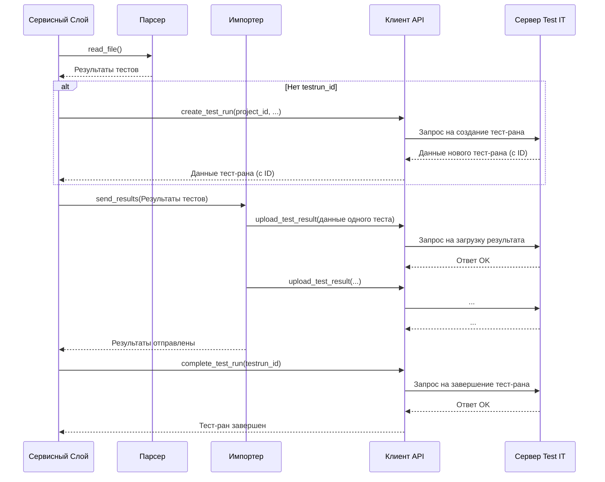

# Chapter 4: Сервисный Слой (Оркестратор)


В [предыдущей главе: Клиент API Test IT](03_клиент_api_test_it_.md) мы познакомились с `ApiClient`, нашим "послом", который умеет общаться с сервером Test IT по сети. Он может отправлять запросы и получать ответы. Но кто говорит этому "послу", *что* именно нужно сделать? Кто решает, когда создать тест-ран, когда загрузить результаты, а когда завершить работу?

Именно эту роль выполняет **Сервисный Слой (`Service`)**, который часто называют **Оркестратором**.

## Дирижер для всех компонентов

Представьте себе оркестр. Есть скрипки (Парсер), трубы (Импортер), барабаны (Клиент API), и у каждого свой инструмент и своя партия. Но чтобы они играли слаженно и получилась музыка (то есть выполнилась задача пользователя), нужен **дирижер**.

Сервисный Слой (`Service`) в `testit-cli` — это и есть такой дирижер. Он:

1.  **Получает партитуру:** Ему передают [Конфигурацию Запуска (`Config`)](01_конфигурация_запуска_.md) (которую мы создали благодаря [Обработке Команд Интерфейса (CLI)](02_обработка_команд_интерфейса__cli__.md)) — это инструкции от пользователя.
2.  **Знает музыкантов:** Он знает о существовании других компонентов и их возможностях — [Парсера](05_парсер_результатов_тестов_.md), [Импортера](06_импортер_результатов_.md), [Клиента API](03_клиент_api_test_it_.md), [Генератора Фильтра](07_генератор_фильтра_автотестов_.md).
3.  **Руководит исполнением:** Он вызывает нужные компоненты в правильном порядке, чтобы выполнить конкретную задачу, которую запросил пользователь (например, `import_results`, `create_test_run`).

Без Сервисного Слоя компоненты просто существовали бы сами по себе, не зная, как взаимодействовать для достижения общей цели. `Service` связывает всё воедино.

## Пример: Дирижируем импортом результатов (`import_results`)

Давайте рассмотрим задачу, которую пользователь инициировал командой `testit-cli results import ...`. Как Сервисный Слой организует этот процесс?

1.  **Получение команды:** Обработчик CLI ([Глава 2](02_обработка_команд_интерфейса__cli__.md)) разбирает команду, создает [Конфигурацию Запуска (`Config`)](01_конфигурация_запуска_.md) и передает ее Сервисному Слою.
2.  **Начало работы:** Сервисный Слой видит, что нужно выполнить `import_results`.
3.  **Шаг 1: Чтение результатов:** Он говорит [Парсеру](05_парсер_результатов_тестов_.md): "Эй, Парсер, возьми пути к файлам из `Config` и прочитай результаты тестов".
4.  **Шаг 2: Создание или получение Тест-рана:**
    *   Если в `Config` не указан `testrun_id`, Сервисный Слой просит [Клиента API](03_клиент_api_test_it_.md): "Создай новый тест-ран в проекте (ID из `Config`) с именем (из `Config`, если есть)". Клиент API возвращает ID нового тест-рана.
    *   Если `testrun_id` уже есть в `Config`, Сервисный Слой может (если нужно) запросить у Клиента API информацию об этом тест-ране.
5.  **Шаг 3: Отправка результатов:** Сервисный Слой передает прочитанные результаты [Импортеру](06_импортер_результатов_.md), говоря: "Импортер, отправь эти результаты в Test IT, используя вот этот `testrun_id` и данные из `Config`". Импортер использует [Клиента API](03_клиент_api_test_it_.md) для фактической отправки данных.
6.  **Шаг 4: Загрузка вложений (если есть):** Сервисный Слой просит [Клиента API](03_клиент_api_test_it_.md) загрузить файлы вложений, указанные в `Config`.
7.  **Шаг 5: Завершение Тест-рана:** Наконец, Сервисный Слой говорит [Клиенту API](03_клиент_api_test_it_.md): "Всё готово, пометь тест-ран (с нашим `testrun_id`) как завершенный".
8.  **Конец:** Задача выполнена.

Видите? `Service` не читает файлы сам и не отправляет данные напрямую. Он координирует работу других специалистов.

## Как это выглядит внутри: Поток управления

Давайте представим поток выполнения команды `import_results` с точки зрения Сервисного Слоя.

1.  **Инициализация:** Сначала `ServiceFactory` (мы видели его в [Главе 1](01_конфигурация_запуска_.md)) создает экземпляр `Service`, передавая ему объект `Config` и уже созданные экземпляры других компонентов (`ApiClient`, `Parser`, `Importer`, `AutotestsFilter`).
2.  **Вызов метода:** Вызывается метод `service.import_results()`.
3.  **Оркестровка:** Внутри `import_results` происходит та самая последовательность действий:
    *   Вызов `__upload_results()` (вспомогательный метод).
    *   Внутри `__upload_results()`:
        *   Вызов `parser.read_file()` для получения результатов.
        *   Проверка `config.testrun_id`. Если нет, вызов `api_client.create_test_run()`.
        *   Вызов `importer.send_results()` для отправки данных.
        *   Возможно, вызов `api_client.upload_attachments()` и `api_client.update_test_run()`.
    *   После `__upload_results()`: вызов `api_client.complete_test_run()`.

**Диаграмма Последовательности (Упрощенная):**



## Заглянем в код: Сервисный Слой в действии

**1. Инициализация (`__init__`)**

Когда `Service` создается, он просто сохраняет ссылки на все необходимые ему инструменты (`Config`, `ApiClient`, `Parser` и т.д.), чтобы потом их использовать.

```python
# Файл: src/testit_cli/service.py (упрощено)
from .models.config import Config
from .parser import Parser
from .apiclient import ApiClient
from .importer import Importer
# ... другие импорты

class Service:
    # Метод инициализации, вызывается при создании объекта Service
    def __init__(
        self,
        config: Config,           # Конфигурация запуска
        api_client: ApiClient,    # Клиент для общения с Test IT
        parser: Parser,           # Парсер для чтения файлов
        importer: Importer,       # Импортер для отправки результатов
        autotests_filter: AutotestsFilter # Генератор фильтра (для другой команды)
    ):
        # Сохраняем все переданные объекты внутри себя для дальнейшего использования
        self.__config = config
        self.__api_client = api_client
        self.__parser = parser
        self.__importer = importer
        self.__autotests_filter = autotests_filter # Нам понадобится позже для других команд
```

*   `__init__` - это специальный метод в Python, который вызывается при создании нового объекта класса.
*   `self.__config = config` - сохраняет переданный объект `config` внутри объекта `Service` под именем `self.__config` (два подчеркивания означают, что это внутренняя переменная).

**2. Метод `import_results`**

Это основной метод для команды импорта. Он вызывает вспомогательный метод для загрузки и затем завершает тест-ран.

```python
# Файл: src/testit_cli/service.py (продолжение)
import logging # Для вывода сообщений

class Service:
    # ... (__init__ выше) ...

    def import_results(self):
        # Шаг 1: Выполнить основную логику загрузки результатов
        self.__upload_results()

        # Шаг 2: После успешной загрузки, завершить тест-ран в Test IT
        logging.info(f"Завершение тест-рана ID: {self.__config.testrun_id}...")
        self.__api_client.complete_test_run(self.__config.testrun_id)
        logging.info("Тест-ран успешно завершен.")
```

*   `self.__upload_results()` - вызов другого метода *этого же* объекта `Service`.
*   `self.__api_client.complete_test_run(...)` - вызов метода у сохраненного объекта `ApiClient`.

**3. Вспомогательный метод `__upload_results` (упрощенно)**

Этот метод выполняет основную часть работы по загрузке: чтение, создание/получение тест-рана, отправка.

```python
# Файл: src/testit_cli/service.py (продолжение)

class Service:
    # ... (__init__, import_results выше) ...

    def __upload_results(self):
        logging.info("Сбор файлов с результатами...")
        # 1. Просим Парсер прочитать файлы (пути берем из Config)
        results = self.__parser.read_file()

        # 2. Проверяем, есть ли ID тест-рана
        if self.__config.testrun_id is None:
            logging.info("ID тест-рана не указан, создаем новый...")
            # Если нет, просим Клиент API создать новый тест-ран
            test_run = self.__create_test_run() # Вызов другого внутреннего метода
            self.__config.testrun_id = test_run.id # Сохраняем ID созданного рана
            logging.info(f"Создан тест-ран с ID: {test_run.id}")
        else:
            # Если ID есть, получаем информацию о нем (может понадобиться project_id)
            logging.info(f"Используем существующий тест-ран ID: {self.__config.testrun_id}")
            test_run = self.__api_client.get_test_run(self.__config.testrun_id)
            self.__config.project_id = test_run.project_id # Убедимся, что project_id есть

        logging.info("Отправка результатов тестов в Test IT...")
        # 3. Просим Импортер отправить прочитанные результаты
        self.__importer.send_results(results)

        # 4. Загружаем вложения (если они указаны в Config)
        self.__update_test_run_with_attachments(test_run) # Еще один внутренний метод

        logging.info("Результаты тестов успешно отправлены.")

    # Вспомогательный метод для создания тест-рана
    def __create_test_run(self) -> TestRun:
        # Используем Клиент API для создания
        return self.__api_client.create_test_run(
            self.__config.project_id,
            self.__config.testrun_name
        )

    # Вспомогательный метод для загрузки вложений
    def __update_test_run_with_attachments(self, test_run: TestRun):
        # ... (логика получения путей к файлам из config) ...
        # attachments = self.__upload_attachments() # Вызов api_client.upload_attachments
        # test_run.attachments.extend(attachments)
        # self.__api_client.update_test_run(test_run) # Обновляем тест-ран
        # Здесь мы упрощаем, но суть - использование ApiClient
        logging.debug("Проверка и загрузка вложений (если есть)...")
        pass # Упрощение для примера
```

*   Здесь мы видим, как `Service` вызывает методы `self.__parser`, `self.__api_client`, `self.__importer` в нужной последовательности.
*   Он использует данные из `self.__config` (например, `testrun_id`, `project_id`, пути к файлам (неявно внутри парсера/импортера)).
*   Он также вызывает другие *свои* вспомогательные методы (`__create_test_run`, `__update_test_run_with_attachments`), чтобы разбить логику на части.

**Другие Команды = Другие Методы**

Класс `Service` содержит и другие публичные методы, соответствующие командам `testit-cli`:
*   `upload_results()`: Похож на `import_results`, но *не* завершает тест-ран в конце.
*   `create_test_run()`: Использует `__api_client.create_test_run()` и сохраняет ID в файл (`--output`).
*   `finished_test_run()`: Использует `__api_client.complete_test_run()`.
*   `upload_attachments_for_test_run()`: Использует `__api_client.upload_attachments()` и `__api_client.update_test_run()`.
*   `create_filter_for_test_framework()`: Использует `__autotests_filter.create_filter()` (компонент, о котором мы поговорим в [Главе 7](07_генератор_фильтра_автотестов_.md)).

Каждый из этих методов оркеструет свою последовательность вызовов других компонентов для выполнения конкретной задачи.

## Заключение

В этой главе мы познакомились с Сервисным Слоем (`Service`) — главным дирижером `testit-cli`. Мы узнали, что:

*   Он **координирует** работу всех остальных компонентов ([Парсера](05_парсер_результатов_тестов_.md), [Импортера](06_импортер_результатов_.md), [Клиента API](03_клиент_api_test_it_.md) и др.).
*   Он получает **инструкции** в виде объекта [Конфигурации Запуска (`Config`)](01_конфигурация_запуска_.md).
*   Он содержит **методы для каждой основной команды** `testit-cli` (`import_results`, `create_test_run` и т.д.).
*   Внутри этих методов он **вызывает** нужные компоненты в правильном порядке, передавая им необходимые данные из `Config`.
*   Он связывает все части `testit-cli` воедино для выполнения конечной цели пользователя.

Теперь, когда мы понимаем, кто руководит процессом, давайте подробнее рассмотрим одного из ключевых "музыкантов" в этом оркестре — того, кто отвечает за чтение и понимание файлов с результатами ваших тестов.

Перейдем к [Главе 5: Парсер Результатов Тестов](05_парсер_результатов_тестов_.md), чтобы узнать, как `testit-cli` извлекает данные из файлов вроде `junit.xml`!

---

Generated by [AI Codebase Knowledge Builder](https://github.com/The-Pocket/Tutorial-Codebase-Knowledge)