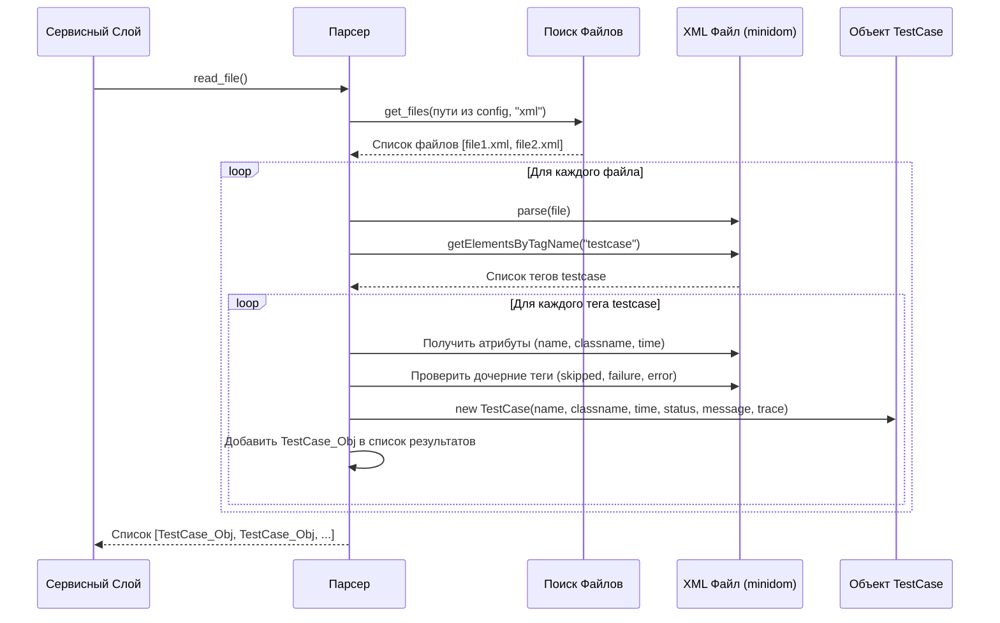

# Chapter 5: Парсер Результатов Тестов


В [предыдущей главе: Сервисный Слой (Оркестратор)](04_сервисный_слой__оркестратор__.md) мы увидели, как `Service` действует словно дирижер, координируя работу всех компонентов `testit-cli`. Он получает инструкции из [Конфигурации Запуска (`Config`)](01_конфигурация_запуска_.md) и говорит другим частям программы, что делать.

Но одна из ключевых задач `testit-cli` — это загрузка результатов тестов в Test IT. Эти результаты обычно хранятся в файлах, созданных вашими инструментами тестирования (например, JUnit, TestNG, Pytest). Как `testit-cli` понимает содержимое этих файлов? Здесь на сцену выходит **Парсер Результатов Тестов** (`Parser`).

## Что такое Парсер и Зачем он Нужен?

Представьте, что у вас есть отчет о тестировании в стандартном формате, например, **JUnit XML**. Это как записка на особом техническом языке. Чтобы `testit-cli` понял эту записку и смог использовать информацию из нее (какой тест прошел, какой упал, сколько времени выполнялся), нужен "переводчик".

**Парсер Результатов Тестов (`Parser`)** — это и есть такой переводчик. Его работа:

1.  **Взять файлы отчетов:** Ему говорят, где лежат файлы с результатами (пути берутся из `config.results`).
2.  **Прочитать содержимое:** Он открывает каждый указанный файл (обычно это XML).
3.  **Найти нужную информацию:** Он ищет внутри файла специальные теги и атрибуты, которые описывают каждый отдельный тест:
    *   Имя теста (например, `test_login_success`)
    *   Класс или пространство имен, где находится тест (например, `auth_tests.LoginTests`)
    *   Время выполнения теста (например, `0.123` секунды)
    *   Результат теста: **Успешно (`Passed`)**, **Неуспешно (`Failed`)** или **Пропущен (`Skipped`)**.
    *   Если тест упал, то сообщение об ошибке и трассировку стека (подробный отчет о том, где произошла ошибка).
4.  **Преобразовать в понятный формат:** Всю найденную информацию о каждом тесте он упаковывает в специальный контейнер — объект `TestCase` (внутренний формат `testit-cli`).
5.  **Отдать список:** Он возвращает список этих `TestCase` объектов [Сервисному Слою](04_сервисный_слой__оркестратор_.md), который затем передаст их [Импортеру Результатов](06_импортер_результатов_.md) для отправки в Test IT.

Без Парсера `testit-cli` смотрел бы на ваши файлы отчетов как на непонятные символы. Парсер превращает эти файлы в структурированные данные, готовые к дальнейшей обработке.

## Как используется Парсер?

[Сервисный Слой (Оркестратор)](04_сервисный_слой__оркестратор_.md) — главный пользователь Парсера. Когда выполняется команда `import_results` или `upload_results`, Сервисный Слой делает следующее:

1.  **Получает Конфигурацию:** У него есть объект `Config` со всеми настройками, включая `config.results` (список путей к файлам отчетов).
2.  **Вызывает Парсер:** Он создает экземпляр `Parser`, передавая ему `Config`, и вызывает его метод `read_file()`.
3.  **Получает Результаты:** Метод `read_file()` возвращает список объектов `TestCase`. Каждый объект в списке представляет один тест из ваших файлов отчетов.
4.  **Передает Дальше:** Сервисный Слой передает этот список `TestCase` [Импортеру Результатов](06_импортер_результатов_.md) для загрузки в Test IT.

**Примерный код (внутри Сервисного Слоя):**

```python
# Фрагмент из src/testit_cli/service.py (упрощено)

class Service:
    def __init__(self, config: Config, api_client: ApiClient, parser: Parser, importer: Importer, ...):
        # ... сохраняем parser ...
        self.__parser = parser
        self.__config = config
        # ...

    def __upload_results(self):
        logging.info("Сбор файлов с результатами...")
        # !!! ВОТ ОНО !!! Вызов Парсера для чтения файлов
        # Пути к файлам берутся из self.__config, который был передан парсеру при создании
        results_from_files: list[TestCase] = self.__parser.read_file() # Получаем список объектов TestCase

        # ... Дальше эти 'results_from_files' используются для:
        # - Определения testrun_id (если не задан)
        # - Передачи в Импортер для отправки в Test IT ...
        logging.info(f"Найдено {len(results_from_files)} тестов в файлах.")
        # self.__importer.send_results(results_from_files)
```

*   `results_from_files: list[TestCase]`: Мы ожидаем получить список (`list`), состоящий из объектов типа `TestCase`.
*   `self.__parser.read_file()`: Основной вызов, запускающий процесс чтения и разбора файлов.

## Что на входе и что на выходе?

*   **Вход:**
    *   Объект [Конфигурация Запуска (`Config`)](01_конфигурация_запуска_.md), из которого Парсер берет:
        *   `config.results`: Список путей к файлам или папкам с XML-отчетами.
        *   `config.separator`: Необязательный разделитель для разделения `namespace` и `classname`.
        *   `config.namespace`: Необязательное значение для переопределения `namespace` для всех тестов.
        *   `config.classname`: Необязательное значение для переопределения `classname` для всех тестов.
        *   `config.ignore_flaky_failure`: Флаг, указывающий, игнорировать ли тесты, помеченные как `flakyFailure`.
*   **Выход:**
    *   Список объектов `TestCase`. Каждый объект `TestCase` содержит информацию об одном тесте: имя, класс, пространство имен, длительность, статус (`Passed`, `Failed`, `Skipped`), сообщение об ошибке и трассировку стека.

## Как Парсер работает внутри: Шаг за Шагом

Давайте представим, что `testit-cli` получил команду загрузить результаты из папки `test-reports/`.

1.  **Инициализация:** [Сервисный Слой](04_сервисный_слой__оркестратор_.md) создает `Parser`, передавая ему `Config`. `Parser` сохраняет нужные части `Config` (пути, разделитель и т.д.) внутри себя.
2.  **Вызов `read_file()`:** Сервисный Слой вызывает `parser.read_file()`.
3.  **Поиск Файлов:** `Parser` обращается к помощнику `FileWorker`, чтобы найти все файлы с расширением `.xml` в указанной папке `test-reports/`. Допустим, `FileWorker` нашел `report1.xml` и `report2.xml`.
4.  **Чтение Первого Файла (`report1.xml`):**
    *   Парсер открывает `report1.xml`.
    *   Он использует стандартную библиотеку Python (`xml.dom.minidom`) для разбора (парсинга) XML-структуры файла. Это как построить дерево из тегов и атрибутов файла.
    *   Парсер ищет в этом дереве теги, обозначающие тесты (обычно `<testcase>` или `<test-case>`).
5.  **Обработка Теста:**
    *   Найден тег `<testcase name="test_login" classname="auth.LoginTests" time="0.5">`.
    *   Парсер извлекает атрибуты: `name="test_login"`, `classname="auth.LoginTests"`, `time="0.5"`.
    *   Он создает новый объект `TestCase`, заполняя его этими данными (`name`, `classname`, `namespace` (из `classname`), `duration`). Изначально статус ставится `Passed`.
    *   Парсер смотрит внутрь тега `<testcase>`:
        *   Нашел тег `<failure message="Login failed">Some trace...</failure>`?
        *   Да! Значит, тест упал. Он меняет статус в объекте `TestCase` на `Failed`.
        *   Он извлекает `message="Login failed"` и текст `Some trace...` и сохраняет их в `TestCase`.
    *   Добавляет готовый объект `TestCase` в общий список результатов.
6.  **Повторение:** Парсер находит следующий тег `<testcase>` в `report1.xml`, обрабатывает его, добавляет в список. Так продолжается до конца файла.
7.  **Чтение Второго Файла (`report2.xml`):** Парсер открывает `report2.xml` и повторяет шаги 4-6 для всех тестов в этом файле, добавляя их `TestCase` в тот же общий список.
8.  **Завершение:** Все файлы обработаны. Парсер возвращает [Сервисному Слою](04_сервисный_слой__оркестратор_.md) полный список объектов `TestCase` из всех найденных файлов.

**Упрощенная Диаграмма Последовательности:**



## Внутреннее устройство: Заглянем в код

Давайте посмотрим на основные части кода Парсера.

**1. Инициализация (`__init__`)**

Здесь Парсер просто сохраняет нужные ему настройки из объекта `Config`.

```python
# Файл: src/testit_cli/parser.py

from .models.config import Config
from .models.testcase import TestCase
from .file_worker import FileWorker
# ... другие импорты ...

class Parser:
    # ... (константы вроде __FAILURE_NODE_NAMES) ...

    def __init__(self, config: Config):
        # Сохраняем нужные параметры из конфигурации
        self.__paths_to_results = config.results
        self.__separator = config.separator
        self.__namespace = config.namespace
        self.__classname = config.classname
        self.__ignore_flaky_failure = config.ignore_flaky_failure
```

*   Конструктор (`__init__`) получает объект `Config` и сохраняет нужные поля (пути к результатам, разделители, флаги) во внутренних переменных (начинающихся с `__`).

**2. Основной метод `read_file()`**

Этот метод выполняет основную работу: находит файлы, читает их и извлекает данные.

```python
# Файл: src/testit_cli/parser.py (продолжение)
import logging
from xml.dom import minidom
from .models.status import Status # Импортируем Enum статусов

class Parser:
    # ... (__init__ и константы) ...

    def read_file(self) -> list[TestCase]: # Возвращает список TestCase
        results = [] # Здесь будем копить найденные тесты
        files = []

        # 1. Находим все XML файлы по путям из конфигурации
        for path_to_results in self.__paths_to_results:
            files.extend(FileWorker.get_files(path_to_results, "xml"))

        logging.info(f"Найдено {len(files)} файлов с результатами.")

        # 2. Обрабатываем каждый найденный файл
        for file in files:
            logging.debug(f"Чтение файла: {file}")
            try:
                xml = minidom.parse(file) # Разбираем XML
                testcases_elements = self.__get_testcases(xml) # Ищем теги <testcase>

                # 3. Обрабатываем каждый тег <testcase>
                for elem in testcases_elements:
                    testcase = self.__parse_testcase_element(elem) # Разбираем один тест
                    if testcase:
                      results.append(testcase) # Добавляем в список
            except Exception as e:
                logging.error(f"Ошибка при парсинге файла {file}: {e}")

        logging.info(f"Всего найдено {len(results)} тестов в файлах.")
        return results

    # Вспомогательный метод для поиска тегов тестов
    @classmethod
    def __get_testcases(cls, xml) -> list:
        for tag in cls.__TAGS_OF_TESTS: # Пробуем разные имена тегов
            testcases = xml.getElementsByTagName(tag)
            if testcases:
                return testcases
        return [] # Не нашли

    # ... (метод __parse_testcase_element ниже) ...
```

*   Сначала собираются все пути к файлам с помощью `FileWorker`.
*   Затем идет цикл по каждому файлу.
*   `minidom.parse(file)` читает и разбирает структуру XML.
*   `self.__get_testcases(xml)` находит все элементы, соответствующие тестам (например, `<testcase>`).
*   Для каждого такого элемента вызывается `self.__parse_testcase_element` (см. ниже).
*   Найденные `TestCase` добавляются в список `results`.

**3. Метод разбора одного теста (`__parse_testcase_element`)**

Этот (упрощенный) метод берет один XML-элемент `<testcase>` и превращает его в объект `TestCase`.

```python
# Файл: src/testit_cli/parser.py (продолжение)

class Parser:
    # ... (__init__, read_file, __get_testcases) ...

    def __parse_testcase_element(self, elem) -> TestCase | None:
        """Разбирает один XML элемент <testcase> и создает объект TestCase."""
        try:
            # Извлекаем базовые атрибуты
            name = elem.attributes["name"].value
            duration = float(elem.attributes["time"].value) if "time" in elem.attributes else 0
            classname_full = elem.attributes["classname"].value if "classname" in elem.attributes else "UnknownClass"

            # Определяем namespace и classname (с учетом разделителя из config)
            name_space = self.__namespace # Используем из config, если задан
            class_name = self.__classname # Используем из config, если задан
            if not name_space and not class_name and self.__separator and self.__separator in classname_full:
                parts = classname_full.rsplit(self.__separator, 1)
                name_space = parts[0]
                class_name = parts[1]
            elif not class_name: # Если не задан извне и не разделен
                class_name = classname_full
            elif not name_space:
                name_space = "DefaultNamespace"

            # Создаем объект TestCase (статус по умолчанию PASSED)
            testcase = TestCase(name, name_space, class_name, duration)

            # Проверяем дочерние узлы на статус (Skipped, Failed, Error)
            message = ""
            trace = ""
            is_failed = False
            is_skipped = False
            is_flaky = False

            for child in elem.childNodes:
                if child.nodeName == "skipped":
                    is_skipped = True
                    if child.attributes and self.__MESSAGE_ATTRIBUTE_NAME in child.attributes:
                         message = child.attributes[self.__MESSAGE_ATTRIBUTE_NAME].value
                    break # Пропущенный тест дальше не смотрим

                # Проверяем теги ошибок/сбоев
                if child.nodeName in self.__FAILURE_NODE_NAMES:
                    # Это flaky но мы его игнорируем?
                    is_flaky_node = child.nodeName == self.__FLAKY_FAILURE_NODE_NAME
                    if is_flaky_node and self.__ignore_flaky_failure:
                         is_flaky = True # Пометим как flaky, но статус не FAILED
                         continue # Игнорируем эту ошибку

                    # Не пустой ли тег? (например <system-err/>)
                    if len(child.childNodes) == 0 and len(child.attributes) == 0:
                        continue # Пустой тег не считаем за ошибку

                    is_failed = True # Нашли реальную ошибку
                    if child.attributes and self.__MESSAGE_ATTRIBUTE_NAME in child.attributes:
                        message = child.attributes[self.__MESSAGE_ATTRIBUTE_NAME].value
                    trace += self.__form_trace(child.childNodes) # Собираем трассировку

            # Устанавливаем финальный статус и детали
            if is_skipped:
                testcase.set_status(Status.SKIPPED)
                testcase.set_message(message or "Skipped")
            elif is_failed:
                testcase.set_status(Status.FAILED)
                testcase.set_message(message or "Failed")
                testcase.set_trace(trace)
            # Если не skipped и не failed, статус остается PASSED

            testcase.set_is_flaky(is_flaky) # Устанавливаем флаг flaky

            return testcase
        except Exception as e:
            logging.warning(f"Не удалось разобрать элемент testcase: {e}. Элемент: {elem.toxml()}")
            return None # Пропускаем этот тест, если ошибка разбора

    # Вспомогательный метод для извлечения текста из узлов (трассировки)
    @classmethod
    def __form_trace(cls, child_nodes: list) -> str:
        # ... (рекурсивно собирает текст из узлов) ...
        trace = ""
        for node in child_nodes:
             if node.nodeType == node.TEXT_NODE:
                 trace += node.data
             elif node.childNodes:
                 trace += cls.__form_trace(node.childNodes)
        return trace.strip() + "\n"

```

*   Этот метод извлекает атрибуты (`name`, `time`, `classname`).
*   Определяет `namespace` и `classname`, используя опции из `Config`, если они заданы.
*   Создает `TestCase` с начальным статусом `PASSED`.
*   Затем он перебирает дочерние узлы (`childNodes`) внутри элемента `<testcase>`.
*   Если находит `<skipped>`, ставит статус `SKIPPED`.
*   Если находит тег из списка `__FAILURE_NODE_NAMES` (например, `<failure>`, `<error>`, или специальный `<flakyFailure>`), он проверяет, не нужно ли его игнорировать (согласно `config.ignore_flaky_failure`). Если нет, он ставит статус `FAILED` и извлекает сообщение (`message`) и трассировку (`trace`).
*   В конце он возвращает готовый объект `TestCase`.

**4. Структура `TestCase` и `Status`**

Эти простые классы используются для хранения данных.

```python
# Файл: src/testit_cli/models/status.py
from enum import Enum

# Перечисление возможных статусов теста
class Status(Enum):
    PASSED = "Passed"
    FAILED = "Failed"
    SKIPPED = "Skipped"
```

```python
# Файл: src/testit_cli/models/testcase.py
from datetime import timedelta
from testit_api_client.models import AvailableTestResultOutcome # Для совместимости с API клиентом
from .status import Status

# Класс для хранения информации об одном тесте
class TestCase:
    def __init__(self, name, name_space, class_name, duration_ms):
        self.__name = name
        self.__name_space = name_space
        self.__class_name = class_name
        # Длительность хранится как timedelta, из миллисекунд
        self.__duration = timedelta(milliseconds=float(duration_ms))
        self.__status = Status.PASSED # По умолчанию - Успешно
        self.__message: str | None = None
        self.__trace: str | None = None
        self.__is_flaky: bool = False # Флаг "нестабильности"

    # Методы для получения данных ("геттеры")
    def get_name(self): return self.__name
    def get_name_space(self): return self.__name_space
    def get_class_name(self): return self.__class_name
    def get_duration(self): return self.__duration.total_seconds() * 1000 # Вернем в мс

    # Методы для установки данных ("сеттеры")
    def set_status(self, value: Status): self.__status = value
    def set_message(self, value: str): self.__message = value
    def set_trace(self, value: str): self.__trace = value
    def set_is_flaky(self, value: bool): self.__is_flaky = value

    # Метод для получения статуса в формате, понятном API клиенту
    def get_status(self) -> AvailableTestResultOutcome:
        return AvailableTestResultOutcome(self.__status.value)

    # ... (другие геттеры/сеттеры при необходимости) ...
```

*   `Status` - это простое перечисление (Enum) с тремя возможными вариантами.
*   `TestCase` - это класс, который хранит все данные об одном тесте. У него есть методы для получения (`get_...`) и установки (`set_...`) этих данных.

## Заключение

В этой главе мы разобрались с Парсером Результатов Тестов (`Parser`). Мы узнали, что:

*   Он играет роль **переводчика**, который читает стандартные файлы отчетов (например, JUnit XML).
*   Он **извлекает** из этих файлов информацию о каждом тесте: имя, класс, время, статус, ошибки.
*   Он **преобразует** эту информацию во внутренний формат `testit-cli` — список объектов `TestCase`.
*   Он использует библиотеку для **разбора XML** (`minidom`) и вспомогательный `FileWorker` для поиска файлов.
*   Он передает готовый список `TestCase` [Сервисному Слою](04_сервисный_слой__оркестратор_.md).

Теперь, когда `testit-cli` "прочитал" и "понял" результаты тестов из ваших файлов, что происходит дальше? Как эти данные попадают в Test IT? За это отвечает следующий компонент.

Перейдем к [Главе 6: Импортер Результатов](06_импортер_результатов_.md), чтобы узнать, как `testit-cli` отправляет подготовленные `TestCase` на сервер!

---

Generated by [AI Codebase Knowledge Builder](https://github.com/The-Pocket/Tutorial-Codebase-Knowledge)