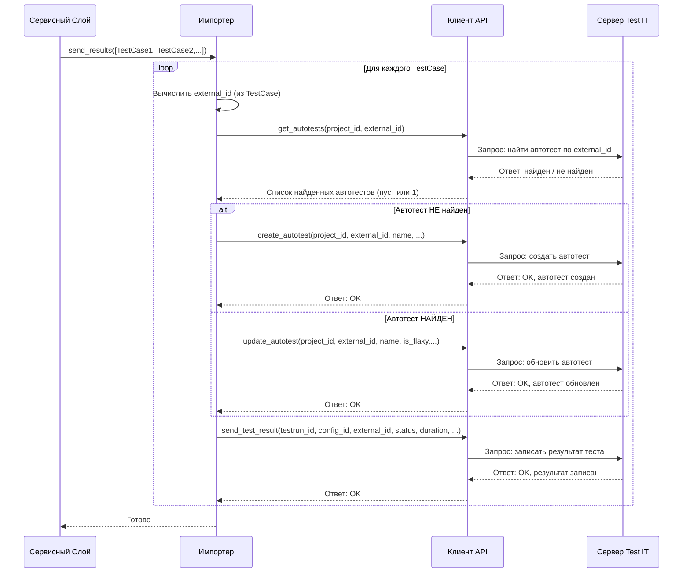

# Chapter 6: Импортер Результатов


В [предыдущей главе: Парсер Результатов Тестов](05_парсер_результатов_тестов_.md) мы узнали, как `testit-cli` читает и "понимает" содержимое ваших файлов с отчетами о тестировании, превращая их в список понятных объектов `TestCase`. Каждый такой объект содержит информацию об одном тесте: его имя, статус, длительность и т.д.

Но что делать с этой информацией дальше? Как она попадает в систему Test IT? Здесь нам на помощь приходит **Импортер Результатов** (`Importer`).

## Что такое Импортер и Зачем он Нужен?

Представьте, что [Парсер](05_парсер_результатов_тестов_.md) — это переводчик, который расшифровал записки о результатах тестов. А **Импортер Результатов** (`Importer`) — это курьер, который берет эти переведенные записки и доставляет их по адресу — в ваш экземпляр Test IT.

**Основная задача Импортера:** взять список объектов `TestCase` (полученный от Парсера) и правильно отправить каждый результат в Test IT, связав его с нужным автотестом и тест-раном.

Вот что он делает для *каждого* результата теста (`TestCase`):

1.  **Вычисляет Уникальный ID:** Он придумывает уникальный идентификатор для теста, который не изменится между запусками (это `external_id`). Обычно он создается на основе имени теста и его класса или пространства имен. Это как присвоить тесту "паспортный номер".
2.  **Ищет "Паспорт" в Test IT:** Используя [Клиента API Test IT](03_клиент_api_test_it_.md), Импортер спрашивает Test IT: "Существует ли уже автотест с таким `external_id` в указанном проекте?".
3.  **Создает или Обновляет Автотест:**
    *   **Если автотеста нет:** Импортер говорит [Клиенту API](03_клиент_api_test_it_.md): "Создай новый автотест с этим `external_id`, именем и классом".
    *   **Если автотест есть:** Импортер может обновить информацию о нем. Например, если тест пришел со статусом `flakyFailure` (нестабильный сбой) и мы его не игнорируем, Импортер может попросить [Клиента API](03_клиент_api_test_it_.md) пометить существующий автотест в Test IT как 'flaky'.
4.  **Отправляет Сам Результат:** Наконец, он говорит [Клиенту API](03_клиент_api_test_it_.md): "Запиши вот этот результат (прошел/упал/пропущен), с такой-то длительностью и сообщением, для автотеста с этим `external_id` в указанный `testrun_id` и `configuration_id`".

Без Импортера наши "переведенные" результаты тестов так и остались бы лежать внутри `testit-cli`, не попадая в центральное хранилище отчетов Test IT. Импортер — это мост между подготовленными данными и системой Test IT.

## Как используется Импортер?

Главным заказчиком для Импортера является [Сервисный Слой (Оркестратор)](04_сервисный_слой__оркестратор_.md). Когда вы запускаете команду импорта (`testit-cli results import ...`), Оркестратор выполняет следующие шаги:

1.  **Получает Результаты от Парсера:** Оркестратор вызывает [Парсер](05_парсер_результатов_тестов_.md), который возвращает список объектов `TestCase`.
2.  **Убеждается, что есть Тест-ран:** Он проверяет, указан ли `testrun_id` в [Конфигурации Запуска (`Config`)](01_конфигурация_запуска_.md). Если нет, он просит [Клиента API](03_клиент_api_test_it_.md) создать новый тест-ран.
3.  **Вызывает Импортер:** Оркестратор передает список `TestCase` и объект `Config` Импортеру, вызывая его метод `send_results`.

**Примерный код (внутри Сервисного Слоя):**

```python
# Фрагмент из src/testit_cli/service.py (упрощено)

class Service:
    def __init__(self, config: Config, api_client: ApiClient, parser: Parser, importer: Importer, ...):
        # ... сохраняем importer ...
        self.__importer = importer
        self.__config = config
        # ...

    def __upload_results(self):
        logging.info("Сбор файлов с результатами...")
        # Получаем результаты от Парсера
        results_from_files: list[TestCase] = self.__parser.read_file()

        # ... (Проверяем/создаем testrun_id, сохраняем в self.__config) ...

        logging.info("Отправка результатов тестов в Test IT...")
        # !!! ВОТ ОНО !!! Вызов Импортера для отправки результатов
        # Передаем список TestCase и используем ID из self.__config
        self.__importer.send_results(results_from_files)

        logging.info("Результаты тестов успешно отправлены.")
```

*   `self.__importer.send_results(results_from_files)`: Оркестратор отдает "переведенные" записки курьеру (Импортеру) для доставки. Импортер сам возьмет нужные `project_id`, `testrun_id`, `configuration_id` из объекта `Config`, который ему передали при создании.

## Внутренний Поток: Доставка Результата Шаг за Шагом

Давайте проследим путь *одного* результата теста (`TestCase`) внутри метода `importer.send_results`.

1.  **Начало:** Импортер получает список `TestCase` и начинает перебирать их по одному.
2.  **Генерируем ID:** Для текущего `TestCase` вычисляется `external_id`. Например, из `namespace="auth.tests"`, `classname="LoginTests"`, `name="test_successful_login"` получится какой-то хэш, например, `a1b2c3d4e5f6...`.
3.  **Проверка Существования:** Импортер обращается к [Клиенту API](03_клиент_api_test_it_.md) (`api_client.get_autotests`) и спрашивает: "Есть ли автотест в проекте (ID из `Config`) с `external_id = a1b2c3d4e5f6...`?".
4.  **Решение:**
    *   **Случай 1: Автотеста НЕТ.** Импортер говорит [Клиенту API](03_клиент_api_test_it_.md) (`api_client.create_autotest`): "Создай автотест с `external_id = a1b2c3d4e5f6...`, именем `test_successful_login` и т.д.".
    *   **Случай 2: Автотест ЕСТЬ.** Импортер проверяет, не помечен ли текущий `TestCase` как `is_flaky`. Если да (и существующий в Test IT тест не был flaky), он говорит [Клиенту API](03_клиент_api_test_it_.md) (`api_client.update_autotest`): "Обнови автотест `a1b2c3d4e5f6...`, установи ему флаг `is_flaky = True`". (Если тест stable, то тоже обновляем на случай если имя поменялось)
5.  **Отправка Результата:** Независимо от того, создавали мы автотест или обновляли, Импортер теперь говорит [Клиенту API](03_клиент_api_test_it_.md) (`api_client.send_test_result`): "Запиши результат для `external_id = a1b2c3d4e5f6...` в тест-ран (ID из `Config`) с конфигурацией (ID из `Config`). Статус: `Passed`, Длительность: `500ms`".
6.  **Следующий:** Импортер переходит к следующему `TestCase` в списке и повторяет шаги 2-5.
7.  **Завершение:** Когда все `TestCase` обработаны, метод `send_results` завершает свою работу.

**Упрощенная Диаграмма Последовательности (для одного теста):**



## Внутреннее устройство: Заглянем в код

Давайте посмотрим на ключевые части Импортера.

**1. Инициализация (`__init__`)**

Импортер получает и сохраняет ссылки на [Клиента API](03_клиент_api_test_it_.md) и [Конфигурацию Запуска (`Config`)](01_конфигурация_запуска_.md). Они понадобятся ему для выполнения запросов к Test IT и получения нужных ID (`project_id`, `testrun_id`, `configuration_id`).

```python
# Файл: src/testit_cli/importer.py
import hashlib # Для вычисления ID
from tqdm import tqdm # Для красивого индикатора прогресса

from .apiclient import ApiClient
from .converter import Converter # Помощник для преобразования данных для API
from .models.config import Config
from .models.testcase import TestCase

class Importer:
    def __init__(self, api_client: ApiClient, config: Config):
        # Сохраняем клиент API и конфигурацию для дальнейшего использования
        self.__api_client = api_client
        self.__config = config
```

*   Конструктор просто запоминает переданные ему `api_client` и `config`.

**2. Метод отправки результатов (`send_results`)**

Это сердце Импортера. Он проходит по всем результатам и выполняет описанную выше логику.

```python
# Файл: src/testit_cli/importer.py (продолжение)
import logging # Для вывода сообщений

class Importer:
    # ... (__init__ выше) ...

    # Метод принимает список объектов TestCase
    def send_results(self, results: [TestCase]):
        # Используем tqdm для отображения прогресс-бара в консоли
        for result in tqdm(results, desc="Загрузка результатов"):
            # 1. Получаем уникальный ID для теста
            external_id = self.__get_external_id(
                result.get_name_space()    # Например, "auth.tests"
                + result.get_class_name()  # Например, "LoginTests"
                + result.get_name()        # Например, "test_successful_login"
            )

            # 2. Ищем автотест в Test IT по ID проекта и external_id
            autotests = self.__api_client.get_autotests(
                # Converter помогает создать правильный объект запроса для API
                Converter.project_id_and_external_id_to_autotests_search_post_request(
                    self.__config.project_id, external_id
                )
            )

            # 3. Создаем или обновляем автотест
            if not autotests:
                # Если список пуст - автотеста нет, создаем его
                logging.debug(f"Создание нового автотеста с external ID: {external_id}")
                self.__api_client.create_autotest(
                    # Converter преобразует наш TestCase в формат для создания автотеста
                    Converter.test_result_to_create_autotest_request(
                        result, external_id, self.__config.project_id
                    )
                )
            else:
                # Автотест найден, обновляем его (если нужно, например, имя или флаг flaky)
                existing_autotest = autotests[0] # Берем первый (должен быть один)
                logging.debug(f"Обновление существующего автотеста с external ID: {external_id}")
                # Если автотест в Test IT уже flaky, сохраняем это
                # (иначе flaky-статус из текущего result может перезаписать его)
                effective_flaky_status = result.get_is_flaky() or existing_autotest.is_flaky
                result.set_is_flaky(effective_flaky_status)

                self.__api_client.update_autotest(
                    # Converter преобразует TestCase в формат для обновления
                    Converter.test_result_to_update_autotest_request(
                        result, external_id, self.__config.project_id
                    )
                )

            # 4. Отправляем сам результат теста в Test IT
            logging.debug(f"Отправка результата для external ID: {external_id}")
            self.__api_client.send_test_result(
                self.__config.testrun_id, # ID текущего тест-рана
                # Converter преобразует TestCase в формат для отправки результата
                Converter.test_result_to_testrun_result_post_model(
                    result, external_id, self.__config.configuration_id # ID конфигурации
                ),
            )
```

*   Цикл `for result in tqdm(results, ...)`: Перебирает каждый `TestCase`, показывая прогресс.
*   `self.__get_external_id(...)`: Вызывает внутренний метод для получения ID (см. ниже).
*   `self.__api_client.get_autotests(...)`: Использует [Клиент API](03_клиент_api_test_it_.md) для поиска. `Converter` используется для подготовки данных в формат, понятный API.
*   `if not autotests:`: Проверяет, вернулся ли пустой список (автотест не найден).
*   `self.__api_client.create_autotest(...)`: Создает автотест через [Клиент API](03_клиент_api_test_it_.md).
*   `else: ... self.__api_client.update_autotest(...)`: Обновляет существующий автотест. Обратите внимание на логику `effective_flaky_status`, чтобы не потерять статус flaky, если он уже был в Test IT.
*   `self.__api_client.send_test_result(...)`: Отправляет фактический результат (статус, время и т.д.) в нужный тест-ран и конфигурацию через [Клиент API](03_клиент_api_test_it_.md).

**3. Метод генерации External ID (`__get_external_id`)**

Этот метод отвечает за создание стабильного и уникального идентификатора для каждого теста на основе его полного имени. Он использует хэширование MD5.

```python
# Файл: src/testit_cli/importer.py (продолжение)

class Importer:
    # ... (__init__, send_results выше) ...

    @staticmethod # Этот метод не зависит от конкретного объекта Importer
    def __get_external_id(value: str) -> str:
        """Генерирует MD5 хэш из строки для использования как external_id."""
        # Берем строку (например, 'auth.testsLoginTests.test_successful_login')
        # Кодируем ее в байты (utf-8)
        # Вычисляем MD5 хэш
        # Превращаем хэш в шестнадцатеричную строку (e.g., 'a1b2c3d4...')
        return hashlib.md5(value.encode("utf-8")).hexdigest()
```

*   `hashlib.md5(...)`: Использует стандартную библиотеку Python для вычисления MD5 хэша.
*   `.encode("utf-8")`: Преобразует строку в последовательность байт, необходимую для хэширования.
*   `.hexdigest()`: Возвращает хэш в виде строки из шестнадцатеричных символов.
*   **Важно:** Пока имя теста, класс и пространство имен не меняются, `external_id` будет одинаковым. Это позволяет `testit-cli` находить один и тот же автотест в Test IT при каждом запуске.

## Заключение

В этой главе мы рассмотрели Импортер Результатов (`Importer`) — ключевой компонент для отправки данных в Test IT. Мы узнали, что:

*   Он берет "переведенные" [Парсером](05_парсер_результатов_тестов_.md) результаты тестов (`TestCase`).
*   Для каждого теста он вычисляет уникальный `external_id`.
*   Он проверяет, существует ли автотест с таким ID в Test IT, используя [Клиента API](03_клиент_api_test_it_.md).
*   Он либо создает новый автотест, либо обновляет существующий (например, помечая как `flaky`).
*   Он отправляет сам результат теста (статус, длительность, сообщение) в указанный тест-ран в Test IT, снова используя [Клиента API](03_клиент_api_test_it_.md).
*   Он использует [Конфигурацию Запуска (`Config`)](01_конфигурация_запуска_.md) для получения `project_id`, `testrun_id` и `configuration_id`.

Импортер — это финальный шаг в процессе загрузки результатов. Он гарантирует, что информация из ваших отчетов будет корректно сохранена и связана в системе Test IT.

В следующей главе мы рассмотрим еще один интересный компонент, который помогает не загружать результаты, а, наоборот, получать из Test IT список тестов для запуска.

Перейдем к [Главе 7: Генератор Фильтра Автотестов](07_генератор_фильтра_автотестов_.md), чтобы узнать, как `testit-cli` может помочь вам выбрать, какие тесты запускать!

---

Generated by [AI Codebase Knowledge Builder](https://github.com/The-Pocket/Tutorial-Codebase-Knowledge)