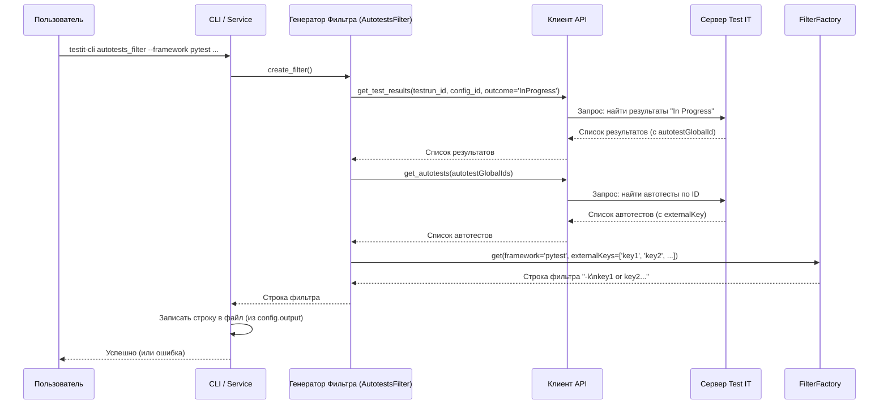

# Chapter 7: Генератор Фильтра Автотестов


В [предыдущей главе: Импортер Результатов](06_импортер_результатов_.md) мы увидели, как `testit-cli` берет обработанные данные о тестах и отправляет их в систему Test IT. Но что, если мы хотим не загружать результаты, а наоборот, использовать Test IT, чтобы решить, какие тесты *запускать*?

Представьте ситуацию: вы хотите перезапустить только те тесты из вашего набора, которые в последнем тест-ране в Test IT остались со статусом "In Progress" (В работе). Запускать все тесты заново может быть долго и неэффективно. Как нам получить список именно этих "незавершенных" тестов и передать его нашему фреймворку автоматизации (например, Pytest, JUnit, NUnit)?

Именно для этого и предназначен **Генератор Фильтра Автотестов** (`AutotestsFilter`) в `testit-cli`.

## Зачем нужен Генератор Фильтра?

Думайте об этом компоненте как о помощнике, который помогает вам **сфокусировать запуск тестов**. Вместо того чтобы запускать сотни тестов, вы можете:

1.  **Спросить у Test IT:** Какие автотесты нужно запустить сейчас для конкретного тест-рана (обычно те, что в статусе "In Progress")?
2.  **Получить Список ID:** Test IT вернет список уникальных идентификаторов (так называемых `external_id`), которые вы присвоили вашим автотестам (как мы видели в [Главе 6: Импортер Результатов](06_импортер_результатов_.md)).
3.  **Преобразовать для Фреймворка:** `testit-cli` знает, как "говорят" разные фреймворки тестирования. Он возьмет этот список `external_id` и превратит его в строку или аргументы командной строки, которые ваш фреймворк поймет как команду "запусти только эти тесты".
4.  **Сохранить и Использовать:** Эту сгенерированную строку можно сохранить в файл и затем использовать при запуске вашего фреймворка.

Это особенно полезно в CI/CD пайплайнах, где нужно эффективно перезапускать только упавшие или невыполненные тесты.

## Как это использовать на практике? Команда `autotests_filter`

Вы взаимодействуете с этим генератором через команду `autotests_filter`. Вот как это выглядит:

```bash
testit-cli autotests_filter \
  --url https://mycompany.testit.software \
  --token MySecretToken \
  --configuration-id aaaaaaaa-bbbb-cccc-dddd-eeeeeeeeeeee \
  --testrun-id 11111111-2222-3333-4444-555555555555 \
  --framework pytest \
  --output pytest_args.txt
```

Давайте разберем ключевые опции:

*   `--url`, `--token`, `--configuration-id`, `--testrun-id`: Эти параметры указывают `testit-cli`, к какому тест-рану и конфигурации в Test IT нужно обратиться.
*   `--framework pytest`: Здесь вы говорите, для какого фреймворка нужно сгенерировать фильтр. `testit-cli` поддерживает разные фреймворки (pytest, robotframework, jest, nunit и другие).
*   `--output pytest_args.txt`: Указывает, в какой файл сохранить результат генерации.

**Что будет в файле `pytest_args.txt`?**

`testit-cli` опросит Test IT, найдет тесты "In Progress" для указанного тест-рана, получит их `external_id` (допустим, 'test\_login\_valid', 'test\_login\_invalid', 'test\_forgot\_password'), и, зная, что мы выбрали `pytest`, запишет в файл `pytest_args.txt` что-то вроде этого:

```
-k
test_login_valid or test_login_invalid or test_forgot_password
```

**Как это использовать?**

Теперь вы можете запустить Pytest, указав ему использовать аргументы из этого файла:

```bash
pytest @pytest_args.txt
```

Pytest прочитает аргументы `-k 'test_login_valid or test_login_invalid or test_forgot_password'` и запустит *только* эти три теста!

## Внутренний Поток: От Команды до Файла Фильтра

Давайте посмотрим, что происходит "под капотом", когда вы выполняете команду `autotests_filter`:

1.  **Команда -> Config:** Вы запускаете команду. [Обработка Команд Интерфейса (CLI)](02_обработка_команд_интерфейса__cli__.md) разбирает ее и создает объект [Конфигурация Запуска (`Config`)](01_конфигурация_запуска_.md), содержащий все опции (`url`, `token`, `testrun_id`, `framework`, `output` и т.д.).
2.  **Service и Filter:** `ServiceFactory` создает [Сервисный Слой (Оркестратор)](04_сервисный_слой__оркестратор_.md) (`Service`) и сам `AutotestsFilter`, передавая им `Config` и [Клиент API Test IT](03_клиент_api_test_it_.md) (`ApiClient`).
3.  **Service -> Filter:** Оркестратор (`Service`) видит, что нужно создать фильтр, и вызывает метод `create_filter()` у объекта `AutotestsFilter`.
4.  **Filter -> API Client (Шаг 1: Получить результаты):** `AutotestsFilter` просит `ApiClient` (`api_client.get_test_results`): "Дай мне все результаты тестов из тест-рана (`testrun_id`) и конфигурации (`configuration_id`), которые имеют статус 'InProgress'".
5.  **API Client -> Test IT -> API Client:** `ApiClient` отправляет запрос в Test IT, получает ответ (список результатов, где каждый содержит `autotestGlobalId`) и возвращает его `AutotestsFilter`.
6.  **Filter -> API Client (Шаг 2: Получить Автотесты):** `AutotestsFilter` извлекает `autotestGlobalId` из полученных результатов. Затем он снова просит `ApiClient` (`api_client.get_autotests`): "Дай мне полную информацию об автотестах вот с этими `autotestGlobalId`".
7.  **API Client -> Test IT -> API Client:** `ApiClient` отправляет второй запрос в Test IT, получает ответ (список автотестов, где каждый содержит важный для нас `externalKey` – это и есть те самые `external_id`, которые мы использовали в [Главе 6](06_импортер_результатов_.md)) и возвращает его `AutotestsFilter`.
8.  **Filter -> FilterFactory:** `AutotestsFilter` извлекает все `externalKey` из информации об автотестах. Теперь у него есть список ключей (например, `['test_login_valid', 'test_login_invalid', 'test_forgot_password']`) и имя фреймворка (из `Config`, например, `'pytest'`). Он передает это специальному помощнику – `FilterFactory`, вызывая `FilterFactory.get('pytest', ['test_login_valid', ...])`.
9.  **FilterFactory Генерирует Строку:** `FilterFactory` знает рецепты для разных фреймворков. Для Pytest он берет ключи и формирует строку: `-k\ntest_login_valid or test_login_invalid or test_forgot_password`.
10. **Возврат и Запись:** `FilterFactory` возвращает сгенерированную строку `AutotestsFilter`, тот возвращает ее `Service`. `Service` берет эту строку и записывает ее в файл, указанный в `config.output` (`pytest_args.txt` в нашем примере).

**Диаграмма Последовательности:**



## Взгляд в Код: Как это Реализовано

Давайте посмотрим на основные части кода, участвующие в этом процессе.

**1. Определение Команды (`click_commands.py`)**

Здесь определяется команда `autotests_filter` и ее опции. Важно, что эта функция собирает все параметры и передает их для создания `Config`, а затем вызывает метод `service.create_filter_for_test_framework()`.

```python
# Файл: src/testit_cli/click_commands.py (упрощено)
import click
from .models.config import Config
from .service_factory import ServiceFactory
from .validation import validate_uuid, validate_url

# ... (другие команды) ...

# Список поддерживаемых фреймворков
PYTHON_FRAMEWORKS = ['pytest', 'robotframework', 'behave', 'nose']
# ... (другие списки: JAVA_FRAMEWORKS, JAVASCRIPT_FRAMEWORKS, и т.д.)
ALL_FRAMEWORKS = PYTHON_FRAMEWORKS + ...

@execute.command("autotests_filter")
# Опции для подключения к Test IT
@click.option("-u", "--url", ..., required=True, callback=validate_url)
@click.option("-t", "--token", ..., required=True)
@click.option("-ci", "--configuration-id", ..., required=True, callback=validate_uuid)
@click.option("-ti", "--testrun-id", ..., required=True, callback=validate_uuid)
# Опции для генератора фильтра
@click.option("-f", "--framework", type=click.Choice(ALL_FRAMEWORKS), required=True, help="Укажите фреймворк тестирования")
@click.option("-o", "--output", type=str, required=True, help="Путь к файлу для сохранения фильтра")
# ... (другие опции: --debug, --disable-cert-validation) ...
def create_filter_for_framework(url, token, configuration_id, testrun_id, framework, debug, output, disable_cert_validation):
    """Создание фильтра автотестов для фреймворков"""
    # Создаем Config из параметров команды
    config = Config(
        url=url,
        token=token,
        project_id="", # Не нужен для этой команды
        configuration_id=configuration_id,
        testrun_id=testrun_id,
        framework=framework, # Сохраняем имя фреймворка
        output=output,       # Сохраняем путь к выходному файлу
        # ... (остальные параметры) ...
        results=[], debug=debug, paths_to_attachments=[],
        disable_cert_validation=disable_cert_validation, ignore_flaky_failure=False
    )
    # Получаем сервис (оркестратор)
    service = ServiceFactory().get(config)

    # !!! Вызываем метод сервиса для создания фильтра !!!
    service.create_filter_for_test_framework()
```

*   `@click.option("-f", "--framework", ...)`: Определяет обязательный параметр `--framework` с выбором из списка `ALL_FRAMEWORKS`.
*   `@click.option("-o", "--output", ...)`: Определяет обязательный параметр `--output` для сохранения результата.
*   `config = Config(...)`: Создается объект `Config`, содержащий всю информацию.
*   `service.create_filter_for_test_framework()`: Запускается основная логика.

**2. Метод в Сервисном Слое (`service.py`)**

Этот метод просто вызывает соответствующий метод у `AutotestsFilter` и затем записывает результат в файл.

```python
# Файл: src/testit_cli/service.py (упрощено)
import logging
from .models.config import Config
from .apiclient import ApiClient
from .autotests_filter import AutotestsFilter
# ... (другие импорты) ...

class Service:
    def __init__(self, config: Config, api_client: ApiClient, autotests_filter: AutotestsFilter, ...):
        # Сохраняем AutotestsFilter и Config
        self.__autotests_filter = autotests_filter
        self.__config = config
        # ...

    def create_filter_for_test_framework(self):
        logging.info(f"Генерация фильтра для фреймворка '{self.__config.framework}'...")

        # 1. Получаем строку фильтра от AutotestsFilter
        filter_value = self.__autotests_filter.create_filter()

        # 2. Записываем результат в файл (путь берем из Config)
        try:
            with open(self.__config.output, "w", encoding="utf-8") as file:
                file.write(filter_value)
            logging.info(f"Фильтр успешно сохранен в файл: {self.__config.output}")
        except Exception as e:
            logging.error(f"Не удалось записать фильтр в файл {self.__config.output}: {e}", exc_info=True)
```

*   `filter_value = self.__autotests_filter.create_filter()`: Главный вызов для получения строки фильтра.
*   `with open(...) ... file.write(filter_value)`: Запись полученной строки в файл, указанный в `config.output`.

**3. Генератор Фильтра (`autotests_filter.py`)**

Это основной компонент, который общается с API и вызывает `FilterFactory`.

```python
# Файл: src/testit_cli/autotests_filter.py
from .apiclient import ApiClient
from .converter import Converter # Помощник для преобразования данных
from .filter_factory import FilterFactory # Фабрика для генерации строк
from .models.config import Config

class AutotestsFilter:
    def __init__(self, api_client: ApiClient, config: Config):
        self.__api_client = api_client
        self.__config = config

    def create_filter(self) -> str: # Возвращает строку фильтра
        """Возвращает строку фильтра для команды запуска фреймворка."""

        # 1. Запрашиваем результаты "In Progress"
        test_results_search_model = (
            Converter.testrun_id_and_configuration_id_and_in_progress_outcome_to_test_results_search_post_request(
                self.__config.testrun_id,
                self.__config.configuration_id
            )
        )
        test_results = self.__api_client.get_test_results(test_results_search_model)

        # 2. Извлекаем ID автотестов из результатов
        autotest_ids = Converter.test_result_short_get_models_to_autotest_ids(test_results)
        if not autotest_ids:
            logging.warning("Не найдено тестов в статусе 'In Progress' для данного тест-рана и конфигурации.")
            return "" # Возвращаем пустую строку, если тестов нет

        # 3. Запрашиваем детали автотестов по их ID
        autotests_search_model = Converter.autotest_ids_to_autotests_search_post_request(autotest_ids)
        autotests = self.__api_client.get_autotests(autotests_search_model)

        # 4. Извлекаем external_keys (это наши external_id)
        external_keys = Converter.autotest_models_to_external_keys(autotests)
        if not external_keys:
             logging.warning("Не удалось получить external keys для найденных автотестов.")
             return ""

        # 5. Генерируем строку фильтра с помощью FilterFactory
        return FilterFactory.get(self.__config, external_keys)
```

*   Здесь происходит последовательность вызовов `ApiClient` и `Converter`, как мы описали в потоке шагов.
*   `Converter` используется для подготовки моделей запросов к API и извлечения нужных данных из ответов.
*   В конце вызывается `FilterFactory.get` для получения финальной строки.

**4. Фабрика Фильтров (`filter_factory.py`)**

Эта "фабрика" содержит "рецепты" для создания строк фильтра для разных фреймворков.

```python
# Файл: src/testit_cli/filter_factory.py
import typing
from .models.config import Config

class FilterFactory:
    @classmethod
    def get(cls, config: Config, external_keys: typing.List[str]) -> str:
        # Словарь, связывающий имя фреймворка с методом генерации
        initialization = {
            'pytest': cls.__initialize_pytest_filter,
            'robotframework': cls.__initialize_robotframework_filter,
            'cucumberjs': cls.__initialize_cucumber_cucumberjs_jest_golang_filter,
            'jest': cls.__initialize_cucumber_cucumberjs_jest_golang_filter,
            'nunit': cls.__initialize_mstest_nunit_xunit_filter,
            # ... и другие фреймворки ...
        }

        # Выбираем нужный метод на основе config.framework и вызываем его
        generator_method = initialization.get(config.framework)
        if generator_method:
            return generator_method(external_keys)
        else:
            # Если фреймворк неизвестен (маловероятно из-за click.Choice)
            logging.error(f"Неизвестный фреймворк: {config.framework}")
            return ""

    # --- Методы генерации для разных фреймворков ---

    @classmethod
    def __initialize_pytest_filter(cls, external_keys: typing.List[str]) -> str:
        """Генерация фильтра для pytest"""
        # Формат: -k 'key1 or key2 or ...'
        if not external_keys: return ""
        keys_combined = ' or '.join(external_keys)
        return f'-k\n{keys_combined}' # Используем \n для разделения -k и ключей

    @staticmethod
    def __initialize_robotframework_filter(external_keys: typing.List[str]) -> str:
        """Генерация фильтра для RobotFramework"""
        # Формат: -t key1 \n -t key2 \n ... (удаляем пробелы из ключей)
        robotframework_filter = ""
        for external_key in external_keys:
            robotframework_filter += f'-t {external_key.replace(" ", "")}\n'
        return robotframework_filter.strip()

    @classmethod
    def __initialize_cucumber_cucumberjs_jest_golang_filter(cls, external_keys: typing.List[str]) -> str:
        """Генерация фильтра для Cucumber, CucumberJS, Jest, Golang"""
        # Формат: ^key1$|^key2$|... (якоря начала и конца строки)
        if not external_keys: return ""
        anchored_keys = [f'^{key}$' for key in external_keys]
        return '|'.join(anchored_keys)

    @staticmethod
    def __initialize_mstest_nunit_xunit_filter(external_keys: typing.List[str]) -> str:
        """Генерация фильтра для MSTest, NUnit, XUnit (.NET)"""
        # Формат: FullyQualifiedName=key1|FullyQualifiedName=key2|...
        if not external_keys: return ""
        qualified_keys = [f'FullyQualifiedName={key}' for key in external_keys]
        return '|'.join(qualified_keys)

    # ... (и другие методы __initialize_... для остальных фреймворков) ...
```

*   `get(cls, config, external_keys)`: Главный метод, который смотрит на `config.framework` и выбирает нужный "рецепт" из словаря `initialization`.
*   `__initialize_..._filter(cls, external_keys)`: Каждый такой метод принимает список `external_keys` и возвращает строку, отформатированную по правилам конкретного фреймворка.

## Заключение

В этой главе мы познакомились с **Генератором Фильтра Автотестов** (`AutotestsFilter`) и фабрикой `FilterFactory`. Мы узнали, что:

*   Этот компонент позволяет получить из Test IT список тестов (обычно "In Progress") для конкретного тест-рана.
*   Он преобразует список `external_id` этих тестов в формат фильтра, понятный вашему фреймворку автоматизации (`pytest`, `nunit`, `jest` и др.).
*   Результат сохраняется в файл, который можно использовать для запуска только выбранных тестов.
*   Это достигается через команду `testit-cli autotests_filter` с указанием фреймворка и пути к выходному файлу.
*   Внутри используется [Клиент API Test IT](03_клиент_api_test_it_.md) для получения данных из Test IT и `FilterFactory` для форматирования строки фильтра.

Этот инструмент может значительно ускорить ваши циклы тестирования, позволяя перезапускать только то, что действительно нужно.

На этом мы завершаем обзор основных компонентов `testit-cli`. Теперь вы имеете представление о том, как эта утилита устроена внутри: от получения команд до взаимодействия с Test IT и обработки файлов. Вы можете вернуться к любой из глав ([Конфигурация Запуска](01_конфигурация_запуска_.md), [Обработка Команд](02_обработка_команд_интерфейса__cli__.md), [Клиент API](03_клиент_api_test_it_.md), [Сервисный Слой](04_сервисный_слой__оркестратор_.md), [Парсер](05_парсер_результатов_тестов_.md), [Импортер](06_импортер_результатов_.md), [Генератор Фильтра](07_генератор_фильтра_автотестов_.md)), чтобы освежить знания о конкретной части системы.

---

Generated by [AI Codebase Knowledge Builder](https://github.com/The-Pocket/Tutorial-Codebase-Knowledge)