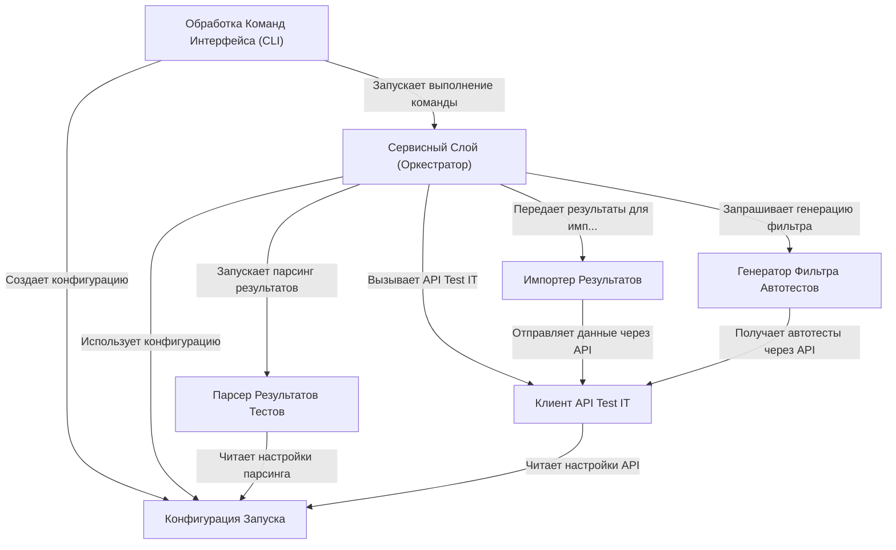

# Tutorial: testit-cli

**testit-cli** — это *инструмент командной строки*, который помогает отправлять результаты автоматических тестов из ваших файлов (например, XML отчетов) в систему управления тестированием **Test IT**.
Вы можете использовать его для:
  - Создания новых **тест-ранов** в Test IT.
  - Загрузки **результатов тестов** (прошел/упал/пропущен) и деталей ошибок в тест-ран.
  - Создания или обновления **автотестов** в Test IT на основе результатов.
  - Загрузки **вложений** (например, скриншотов) к тест-рану.
  - Получения **списка автотестов**, которые нужно запустить, для интеграции с вашими фреймворками (например, Pytest, JUnit).

**Source Repository:** [https://github.com/testit-tms/testit-cli](https://github.com/testit-tms/testit-cli)

## Chapters

1. [Конфигурация Запуска
](01_конфигурация_запуска_.md)
2. [Обработка Команд Интерфейса (CLI)
](02_обработка_команд_интерфейса__cli__.md)
3. [Клиент API Test IT
](03_клиент_api_test_it_.md)
4. [Сервисный Слой (Оркестратор)
](04_сервисный_слой__оркестратор__.md)
5. [Парсер Результатов Тестов
](05_парсер_результатов_тестов_.md)
6. [Импортер Результатов
](06_импортер_результатов_.md)
7. [Генератор Фильтра Автотестов
](07_генератор_фильтра_автотестов_.md)

---

Generated by [AI Codebase Knowledge Builder](https://github.com/The-Pocket/Tutorial-Codebase-Knowledge)